# RusevaVI
## Лабораторная работа 1
### Задание 1
```python
name=str(input("имя "))
vs=int(input("возраст "))
print(f"Привет,{name}!Через год тебе будет {vs+1}.")
```
[Картинка 1]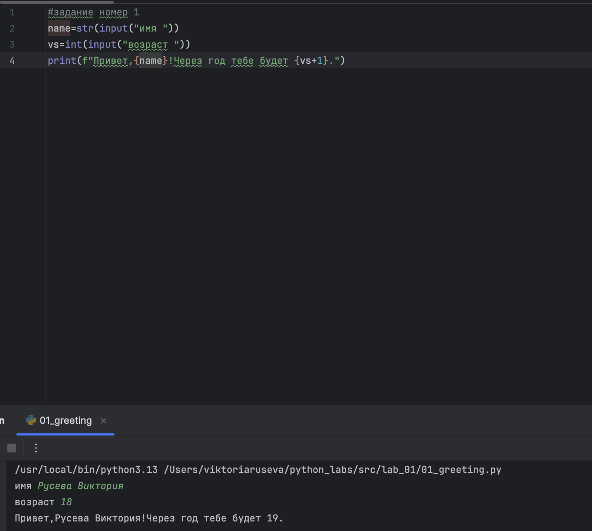

### Задание 2
```python
a=(input('a: '))
a=a.replace(',','.')
a=float(a)
b=(input('b: '))
b=b.replace(',','.')
b=float(b)
print(f"sum={a+b}; avg={(a+b)/2:.2f}")
```
[Картинка 1]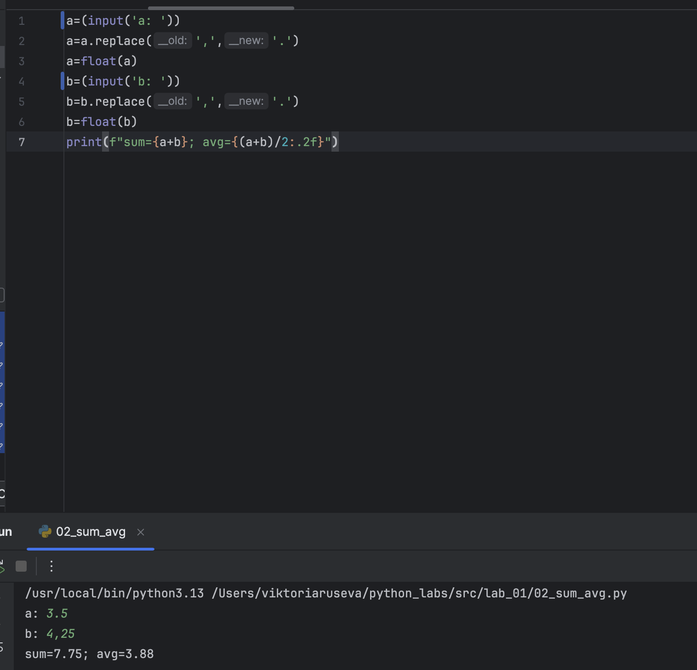

### Задание 3
```python
price=float(input('цена, p: '))
discount=float(input('скидка, %: '))
vat=float(input('ндс, %: '))
base=price*(1-discount/100)
vat_amount=base*(vat/100)
total=base+vat_amount
print(f"база после скидки:{base:.2f} p")
print(f'ндс:{vat_amount:.2f} p')
print(f'итого к оплате:{total:.2f} p')
```
[Картинка 1]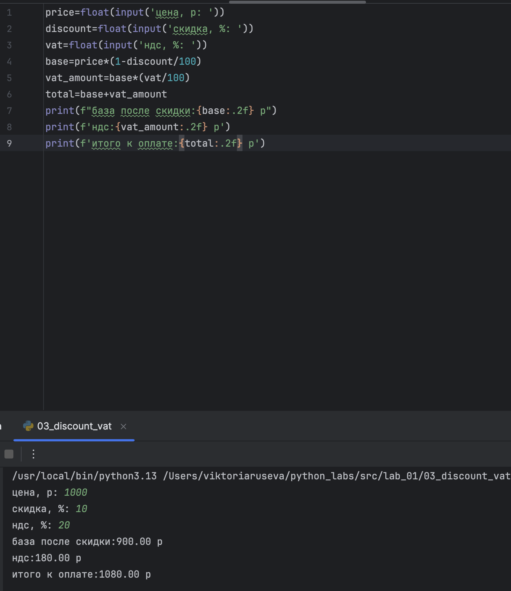

### Задание 4
```python
m=int(input('минуты: '))
print(f'{m//60}:{m-(60*(m//60)):02d}')
```
[Картинка 1]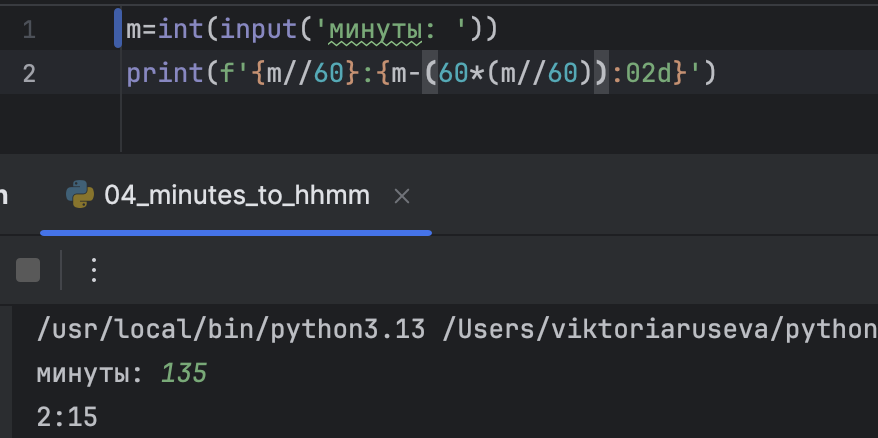

### Задание 5
```python
name=str(input('ФИО: '))
print(f'Инициалы: {(name.split()[0])[0]}{(name.split()[1])[0]}{(name.split()[2])[0]}.')
name =name.replace(' ','')
print(f'Длина (символов):{len(name)+2}')
```
[Картинка 1] 

### Задание 6
```python
n=int(input('in_1: '))
k=1
tr=0
fl=0
for i in range(n):
    k+=1
    name_1, name_2, vs, bl = (input(f'in_{k}: ')).split()
    if bl=='True':
        tr+=1
    else:
        fl+=1
print(f'out: {tr} {fl}')
```
[Картинка 1] 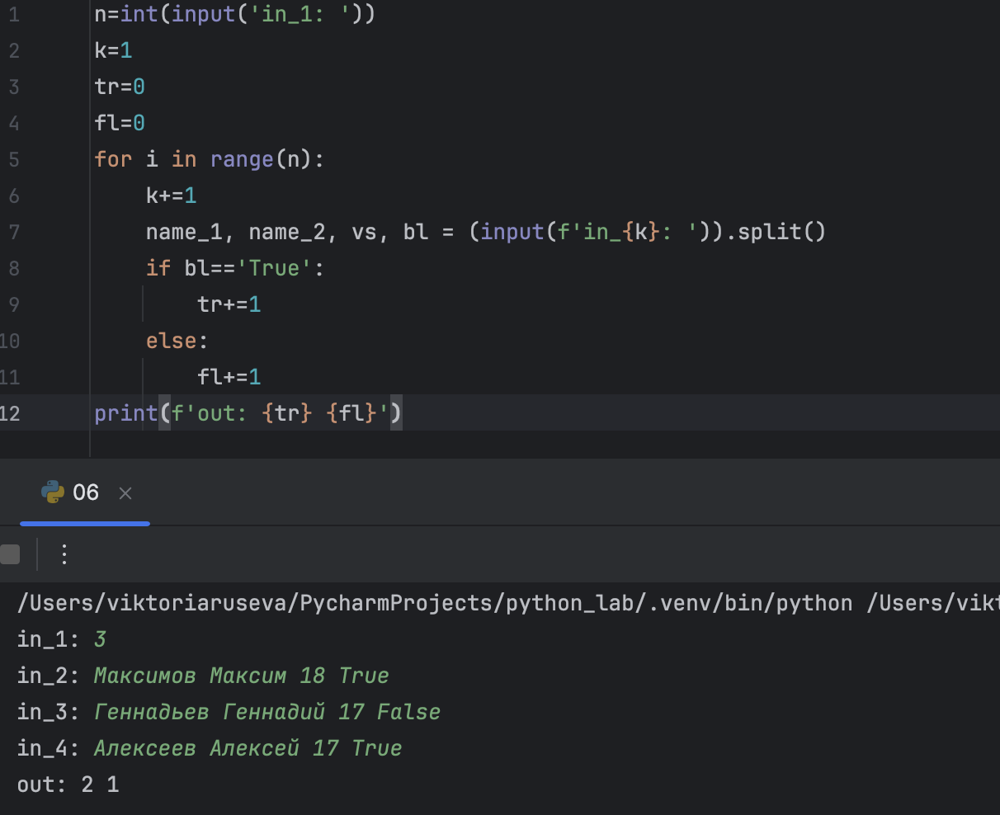

### Задание 7
```python
s=str(input('in: '))
word=[]
id_1=0
id_2=0
id_p=0
for i in 'QWERTYUIOPLKJHGFDSAZXCVBNM':
    if i in s:
        id_1=s.index(i)
for j in '0123456789':
    if (j in s):
        id_2=s.index(j)+1
        break
id_p=s.index('.')
zar=id_2-id_1
for i in range(id_1,id_p+1,zar):
    word.append(s[i])
print(f'out:{''.join(word)}')
```
[Картинка 1] 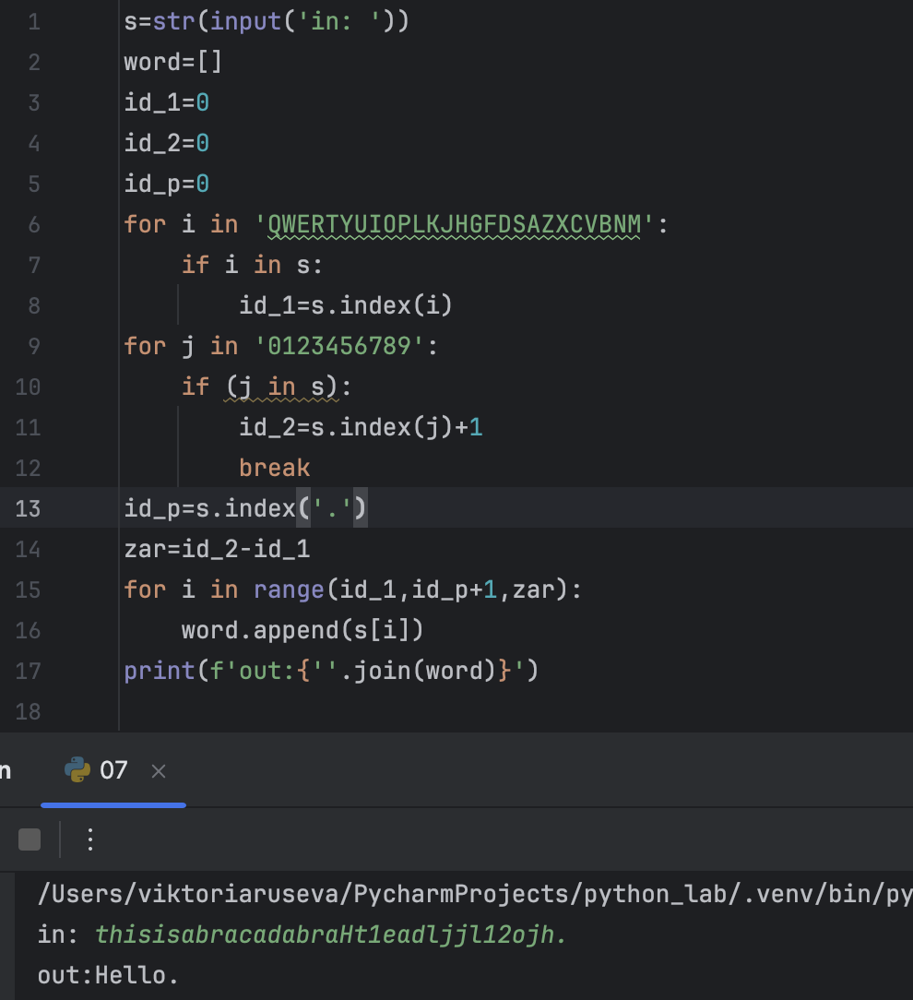

## Лабораторная работа 2
### Задание 1
```python
#1
test1=[3,-1,5,5,0]
test2=[42]
test3=[-5, -2, -9]
test4=[]
test5=[1.5, 2, 2.0, -3.1]
def min_max(nums: list[float | int]) -> tuple[float | int, float | int]:
    list1=[]
    for i in nums:
        list1.append(i)
    if len(list1)==0:
        print('ValueError')
    else:
        res=(min(list1),max(list1))
        print(res)
    return ''
print(min_max(test1))
print(min_max(test2))
print(min_max(test3))
print(min_max(test4))
print(min_max(test5))
#2

test1=[3, 1, 2, 1, 3]
test2=[]
test3=[-1, -1, 0, 2, 2]
test4=[1.0, 1, 2.5, 2.5, 0]
def unique_sorted(nums: list[float | int]) -> list[float | int]:
    int_list=[]
    float_list=[]
    for i in nums:
        if type(i)==int:
            int_list.append(i)
        else:
            float_list.append(i)
    res1 = [x for x in float_list if int(x) in int_list]
    res2 = [x for x in int_list if float(x)  not in float_list]
    print(sorted(set(res1+res2+float_list)))
    return ''
print(unique_sorted(test1))
print(unique_sorted(test2))
print(unique_sorted(test3))
print(unique_sorted(test4))
#3
test1=[[1, 2], [3, 4]]
test2=([1, 2], (3, 4, 5))
test3=[[1], [], [2, 3]]
test4=[[1, 2], "ab"]

def flatten(mat: list[list | tuple]) -> list:
    list1=[]
    list2=[]
    k=0
    for i in mat:
        for j in i:
            list1.append(j)
            if type(j)==int:
                k+=1
            if k==len(list1):
                list2.append(j)
            else:
                print('TypeError')
                break
    if k==len(list1):
        print(list2)
    return ''

print(flatten(test1))
print(flatten(test2))
print(flatten(test3))
print(flatten(test4))
```
[Картинка 1] 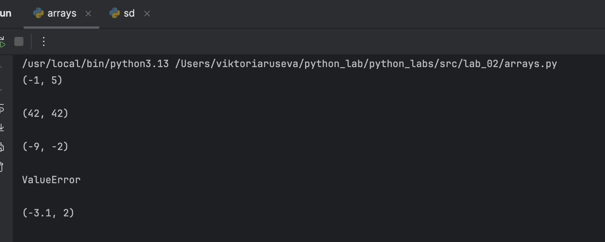
[Картинка 2] 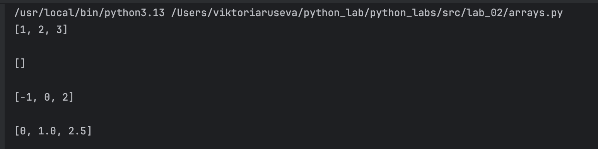
[Картинка 3] 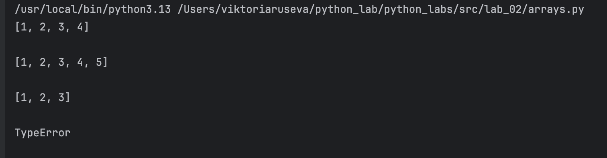


### Задание 2
```python
#1
test1 = [[1, 2, 3]]
test2 = [[1], [2], [3]]
test3 = [[1, 2], [3, 4]]
test4 = []
test5 = [[1, 2], [3]]

def transpose(mat: list[list[float | int]]) -> list[list[float | int]]:
    if len(mat) == 0:
        return []

    for i in range(len(mat) - 1):
        if len(mat[i]) != len(mat[i + 1]):
            return 'ValueError'
    transp = []
    for col_index in range(len(mat[0])):
        row_new = []
        for row_index in range(len(mat)):
            row_new.append(mat[row_index][col_index])
        transp.append(row_new)
    return transp
print(transpose(test1))
print(transpose(test2))
print(transpose(test3))
print(transpose(test4))
print(transpose(test5))
#2
test1=[[1, 2, 3], [4, 5, 6]]
test2=[[-1, 1], [10, -10]]
test3=[[0, 0], [0, 0]]
test4=[[1, 2], [3]]
def row_sums(mat: list[list[float | int]]) -> list[float]:
    list1=[]
    for i in range(len(mat) - 1):
        if len(mat[i]) != len(mat[i + 1]):
            return 'ValueError'
        else:
            for i in mat:
                list1.append(sum(i))
    return list1
print(row_sums(test1))
print(row_sums(test2))
print(row_sums(test3))
print(row_sums(test4))
#3
test1=[[1, 2, 3], [4, 5, 6]]
test2=[[-1, 1], [10, -10]]
test3=[[0, 0], [0, 0]]
test4=[[1, 2], [3]]
def col_sums(mat: list[list[float | int]]) -> list[float]:
    for i in range(len(mat) - 1):
        if len(mat[i]) != len(mat[i + 1]):
            return 'ValueError'
        else:
            lene = 0
            k = 0
            for i in mat:
                lene = len(i)
            summ = [0] * lene
            for i in range(len(mat)):
                for j in range(lene):
                    summ[j] += mat[i][j]
    return summ
print(col_sums(test1))
print(col_sums(test2))
print(col_sums(test3))
print(col_sums(test4))
```
[Картинка 1] 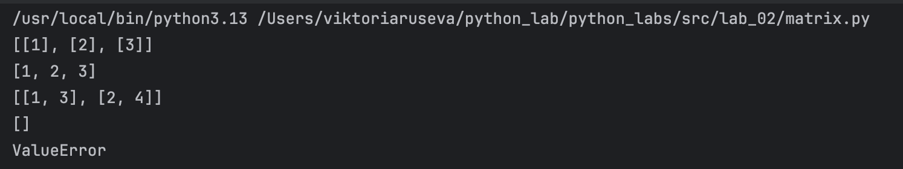
[Картинка 2] 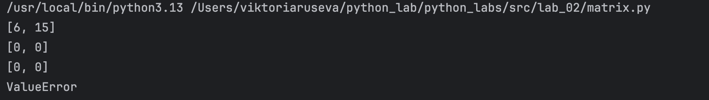
[Картинка 3] 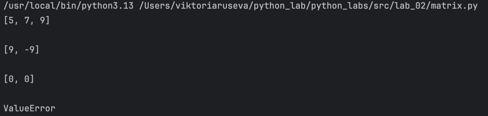


### Задание 3
```python
def format_record(rec: tuple[str, str, float]) -> str:
    fio,group,gpa=rec
    fio = fio.strip()
    name=[]
    if len(fio)==0 or len(group)==0 or type(gpa)!=float:
        return "ValueError"
    else:
        for i in fio.split():
            name.append(i.capitalize())

        if len(name)==3:
            return (f'{(name[0])} {(name[1])[0]}.{(name[2])[0]}., гр. {group}, GPA {gpa:.2f}')
        else:
            return (f'{(name[0])} {(name[1])[0]}., гр. {group}, GPA {gpa:.2f}')
print(format_record(("Иванов Иван Иванович", "BIVT-25", 4.6)))
print(format_record(("Петров Пётр", "IKBO-12", 5.0)))
print(format_record(("Петров Пётр Петрович", "IKBO-12", 5.0)))
print(format_record(("  сидорова  анна   сергеевна ", "ABB-01", 3.999)))
print(format_record(("", "", 5)))

```
[Картинка 1]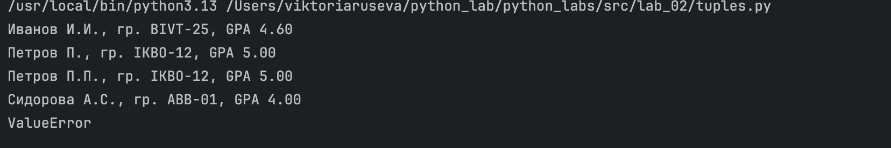

## Лабораторная работа 3
### Задание 1
```python
testcase1 = "ПрИвЕт\nМИр\t"
testcase2 = "ёжик, Ёлка"
testcase3 = "Hello\r\nWorld"
testcase4 = "  двойные   пробелы  "
import re
def normalize(text: str, *, casefold: bool = True, yo2e: bool = True) -> str:
    text = re.sub(r'\s+', ' ', text).strip()
    if casefold:
        text = text.casefold()
    if yo2e:
        text = text.replace('ё', 'e')
    return text


print(normalize(testcase1))
print(normalize(testcase2))
print(normalize(testcase3))
print(normalize(testcase4))

testcase2 = "hello,world!!!"
testcase3 = "по-настоящему круто"
testcase4 = "2025 год"
testcase5 = "emoji 😀 не слово"

import re

def tokenize(text: str) -> list[str]:
    shablon = r'\w+(?:-\w+)*'
    tockens = (re.findall(shablon, normalize(text)))
    return tockens

print(tokenize(testcase1))
print(tokenize(testcase2))
print(tokenize(testcase3))
print(tokenize(testcase4))
print(tokenize(testcase5))

testcase1 = ["a", "b", "a", "c", "b", "a"]
testcase2 = ["bb", "aa", "bb", "aa", "cc"]


def count_freq(tokens: list[str]) -> dict[str, int]:
    fdict = {}
    for token in tokens:
        if token in fdict:
            fdict[token] += 1
        else:
            fdict[token] = 1
    return fdict

def top_n(freq: dict[str, int], n: int = 2) -> list[tuple[str, int]]:
    items = list(freq.items())
    sorted_items = sorted(items, key=lambda x: (-x[1], x[0]))
    return sorted_items[:n]


print(count_freq(testcase1))
print(top_n(count_freq(testcase1)))
print(count_freq(testcase2))
print(top_n(count_freq(testcase2)))

```
[Картинка 1]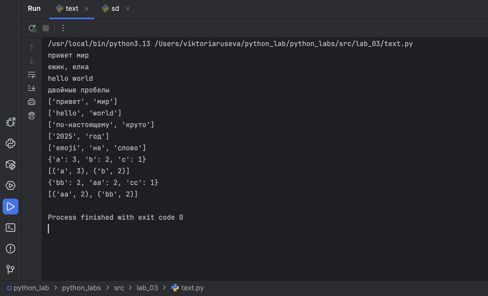

### Задание 2
```python
import sys
import text
stdin = sys.stdin.read()
allwords = text.tokenize(stdin)
uniquewords = text.count_freq(allwords)
top = text.top_n(uniquewords, 5)
print(f'Всего слов: {len(allwords)}')
print(f'Уникальных слов: {len(uniquewords)}')
print("Топ-5:")
for i in top:
    print(i[0] + ':' + str(i[1]))
```
[Картинка 1]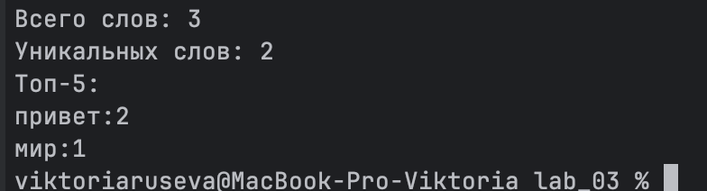

## Лабораторная работа 4
### Задание 1
```python
from pathlib import Path
import csv
from typing import Iterable, Sequence

def read_text(path: str | Path, encoding: str = "utf-8") -> str:
    p = Path(path)
    if p.suffix.lower() != ".txt":
        raise ValueError("Неправильный формат — требуется файл с расширением txt.")
    try:
        return p.read_text(encoding=encoding)
    except FileNotFoundError:
        raise FileNotFoundError(f"Файл не найден")
    except UnicodeDecodeError:
        raise UnicodeDecodeError("Ошибка декодирования. Попробуйте другую кодировку.")


def write_csv(rows: list[tuple | list],path: str | Path,header: tuple[str, ...] | None = None) -> None:
    p = Path(path)
    if p.suffix.lower() != ".csv":
        raise ValueError("Неправильный формат — требуется файл с расширением .csv")

    rows = list(rows)
    if rows:
        length = len(rows[0])
        for r in rows:
            if len(r) != length:
                raise ValueError("Все строки должны иметь одинаковую длину")

    if header is not None and rows:
        if len(header) != len(rows[0]):
            raise ValueError("Длина заголовка не совпадает с длиной строк данных")
    with p.open("w", newline="", encoding="utf-8") as f:
        w = csv.writer(f)
        if header is not None:
            w.writerow(header)
        for r in rows:
            w.writerow(r)
```
#### При больших файлах читаем построчно, не переделывая все строки в список
```python 
def write_csv(rows: Iterable[Sequence], path: str | Path, header: tuple[str, ...] | None = None) -> None:
    p = Path(path)
    with p.open("w", newline="", encoding="utf-8") as f:
        w = csv.writer(f)
        if header is not None:
            w.writerow(header)
        for r in rows:
            w.writerow(r)
```
#### Создание папки data и файла input.txt, так же  check.csv
```python
from pathlib import Path
# cоздаём папку data
Path("data").mkdir(exist_ok=True)
#cоздаём тестовый текстовый файл input.txt
Path("data")/ "input.txt".write_text("Привет, мир! Привет!!!", encoding="utf-8")
# Создание CSV
csv_path = Path("data") / "check.csv"
write_csv([("word", "count"), ("test", 3)], csv_path)
print(csv_path)
```
#### Чтение другой кодировки
```python
def read_text(path: str | Path, encoding: str = "cp1251") -> str:
    p = Path(path)
    return p.read_text(encoding=encoding)
strcp1251=(read_text("data/inputcp1251.txt",encoding='cp1251'))
print(strcp1251)

```
[Картинка 1] 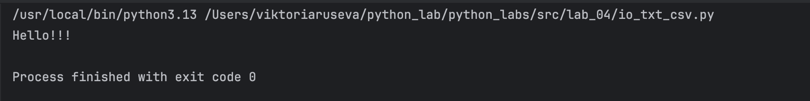
### Ошибки
#### 1) Пустой файл, ошибки UnicodeDecodeError,FileNotFoundError
```python
str_empty=read_text("data/input_empty.txt")
print(f'выводит:{str_empty}')
strcp1251_unicodeerror =(read_text("data/inputcp1251.txt",encoding='utf-32'))
print(strcp1251_unicodeerror)#UnicodeDecodeError
print(read_text("data/input1.txt"))#FileNotFoundError

```
[Картинка 2] 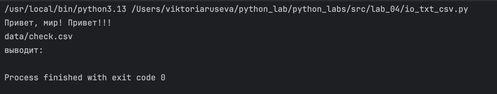

[Картинка 3] 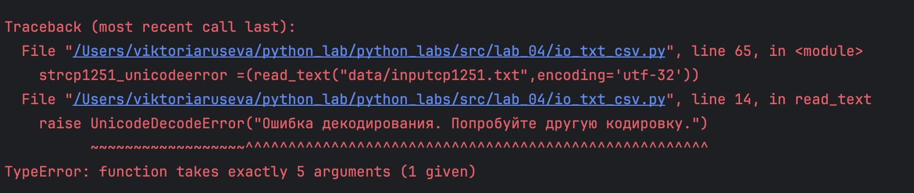
[Картинка 4] 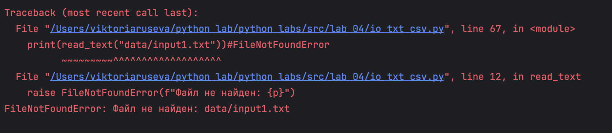 
#### 2) Проверка на создание файла в формате txt и в csv
```python
test1=read_text("data/test1.json")
write_csv(test1,'data/test1.csv')
test2=read_text("data/test2.txt")
write_csv(test2,'data/test2.json')
```
[Картинка 5] 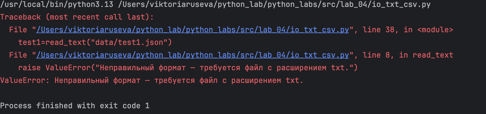

[Картинка 6] 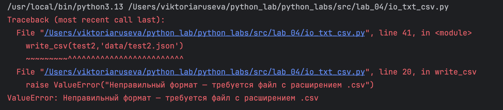
#### 3) Только заголовок,без заголовка, разная длина 
```python
def print_csv(path):
    p=Path(path)
    #r это read
    with p.open('r', encoding='utf-8') as f:
        for line in f:
            print(line.strip())
write_csv([], "data/empty.csv", header=("a","b"))
print_csv("data/empty.csv")
write_csv([("word","count"),("test",3)], "data/check.csv")
print_csv("data/check.csv")
write_csv([("word","count"),("test",3,2)], "data/error.csv")
```
 [Картинка 7] 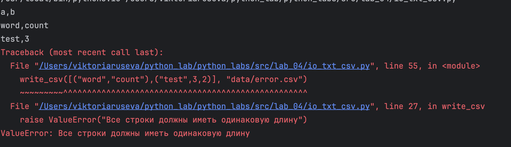
 
### Задание 2
```python
import sys
from pathlib import Path
from collections import Counter
from python_labs.src.lab_03.text import normalize, tokenize, top_n
from python_labs.src.lab_04.io_txt_csv import read_text, write_csv


#Чтение текста
try:
    text = read_text(Path("data/input.txt"))
except FileNotFoundError:
    print(f"Файл не найден: {Path("data/input.txt")}")
    raise
except UnicodeDecodeError:
    print(f"Ошибка кодировки при чтении файла: {Path("data/input.txt")}")
    raise

def frequencies_from_text(text: str) -> dict[str, int]:
    from python_labs.src.lab_03.text import normalize, tokenize, top_n
    tokens = tokenize(normalize(text))
    return Counter(tokens)  # dict-like

def sorted_word_counts(freq: dict[str, int]) -> list[tuple[str, int]]:
    return sorted(freq.items(), key=lambda kv: (-kv[1], kv[0]))

text=sorted_word_counts(frequencies_from_text(read_text("data/input.txt")))
write_csv(text, "data/report.csv", header=("word", "count"))

tekst = read_text("data/input.txt")
tokens = (tokenize(normalize(tekst)))
count=Counter(tokens)
sorted_freq = sorted_word_counts(count)

print(f"Всего слов: {len(tokens)}")
print(f"Уникальных слов: {len(count)}")
print(f"Топ-5:")
for word, col in sorted_freq[:5]:
    print(f"{word}:{col}")
```
[Картинка 8]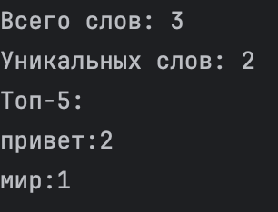

[Картинка 9]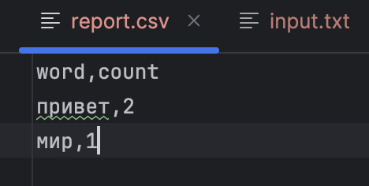

## Лабораторная работа 5
### Задание 1
```python
from pathlib import Path
import json
import csv

def json_to_csv(json_path: str, csv_path: str) -> None:
    p_json = Path(json_path)
    p_csv = Path(csv_path)

    #Проверка расширений
    if p_json.suffix.lower() != ".json":
        raise ValueError("Ожидается файл с расширением .json")
    if p_csv.suffix.lower() != ".csv":
        raise ValueError("Ожидается файл с расширением .csv")

    #Проверка существования JSON
    if not p_json.exists():
        raise FileNotFoundError("Файл JSON не найден")

    # Проверка существования директории для CSV
    if not p_csv.parent.exists():
        raise FileNotFoundError(f"Директория для CSV не найдена")

    # Чтение JSON 
    try:
        data = json.loads(p_json.read_text(encoding="utf-8"))
    except json.JSONDecodeError:
        raise ValueError("Ошибка чтения JSON")

    # Проверка структуры
    if not data or not isinstance(data, list):
        raise ValueError("Пустой JSON или неподдерживаемая структура")
    if not all(isinstance(item, dict) for item in data):
        raise ValueError("JSON должен содержать список словарей")

    # Определяем все возможные ключи 
    all_keys = list(data[0].keys())
    for d in data[1:]:
        for k in d.keys():
            if k not in all_keys:
                all_keys.append(k)

    # Запись CSV 
    with p_csv.open("w", newline="", encoding="utf-8") as f:
        writer = csv.DictWriter(f, fieldnames=all_keys)
        writer.writeheader()
        for row in data:
            writer.writerow({k: row.get(k, "") for k in all_keys})

    # Проверка количества строк 
    with p_csv.open("r", encoding="utf-8", newline="") as f:
        reader = csv.DictReader(f)
        csv_data = list(reader)
        if len(csv_data) != len(data):
            raise ValueError("Количество записей не совпадает после конвертации")


def csv_to_json(csv_path: str, json_path: str) -> None:
    p_csv = Path(csv_path)
    p_json = Path(json_path)

    # Проверка расширений
    if p_csv.suffix.lower() != ".csv":
        raise ValueError("Ожидается файл с расширением .csv")
    if p_json.suffix.lower() != ".json":
        raise ValueError("Ожидается файл с расширением .json")

    # Проверка существования CSV
    if not p_csv.exists():
        raise FileNotFoundError("Файл CSV не найден")

    # Проверка директории для JSON 
    if not p_json.parent.exists():
        raise FileNotFoundError(f"Директория для JSON не найдена")

    # Чтение CSV 
    with p_csv.open("r", encoding="utf-8", newline="") as f:
        reader = csv.DictReader(f)
        if not reader.fieldnames:
            raise ValueError("CSV должен содержать заголовок")
        data = [row for row in reader]

    if not data:
        raise ValueError("CSV пустой")

    # Запись JSON
    with p_json.open("w", encoding="utf-8") as f:
        json.dump(data, f, ensure_ascii=False, indent=2)

    # Проверка совпадения количества записей
    reread = json.loads(p_json.read_text(encoding="utf-8"))
    if len(reread) != len(data):
        raise ValueError("Количество записей не совпадает после конвертации")
```
#### Проверка ошибок:
#### 1) Неверный тип файла, пустой JSON или CSV 
[Картинка 1]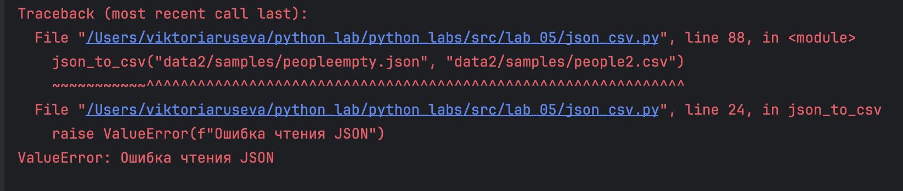

[Картинка 2]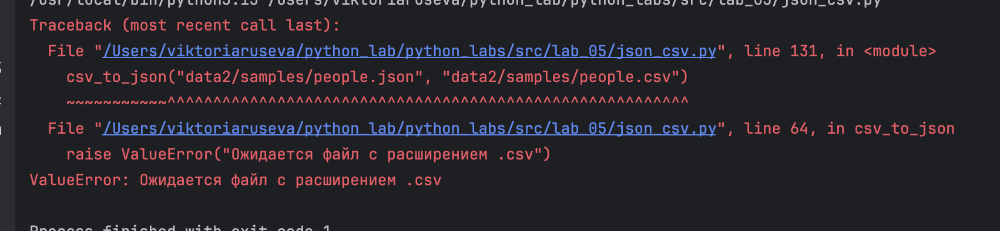

[Картинка 3]
#### 2) Осутствует файл
[Картинка 4]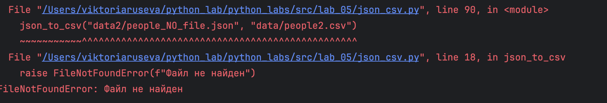

[Картинка 5]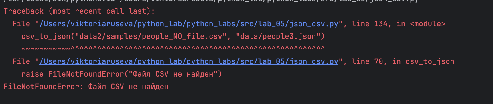

### Задание 2
```python
from pathlib import Path
import csv
from openpyxl import Workbook

def csv_to_xlsx(csv_path: str, xlsx_path: str) -> None:
    p_csv = Path(csv_path)
    p_xlsx = Path(xlsx_path)
    # Проверки путей
    if p_csv.suffix.lower() != ".csv":
        raise ValueError("Ожидается файл с расширением .csv")
    if p_xlsx.suffix.lower() != ".xlsx":
        raise ValueError("Ожидается файл с расширением .xlsx")

    if not p_csv.exists():
        raise FileNotFoundError("Файл CSV не найден")

    # Чтение CSV
    with p_csv.open("r", encoding="utf-8", newline="") as f:
        reader = csv.reader(f)
        rows = list(reader)

    # Проверка содержимого
    if not rows or all(not any(row) for row in rows):
        raise ValueError("Пустой CSV или неподдерживаемая структура")

    # Создание XLSX
    wb = Workbook()
    ws = wb.active
    ws.title = "Sheet1"

    for row in rows:
        ws.append(row)

    # Автоширина
    for col in ws.columns:
    max_len = max(len(str(cell.value or "")) for cell in col)
    col_letter = col[0].column_letter
    ws.column_dimensions[col_letter].width = max(max_len + 2, 8)
    # Проверка директории назначения
    if not p_xlsx.parent.exists():
        raise FileNotFoundError(f"Директория для XLSX не найдена")

    # Сохранение
    wb.save(p_xlsx)

```
#### Проверка ошибок:
#### 1) Неверный тип файла, пустой JSON или CSV 
[Картинка 1]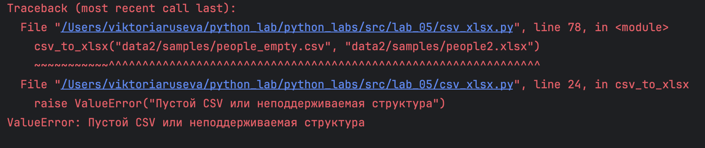

[Картинка 2]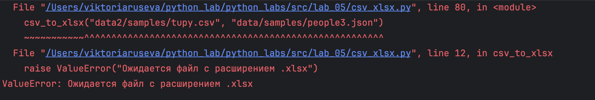

#### 2) Осутствует файл
[Картинка 3]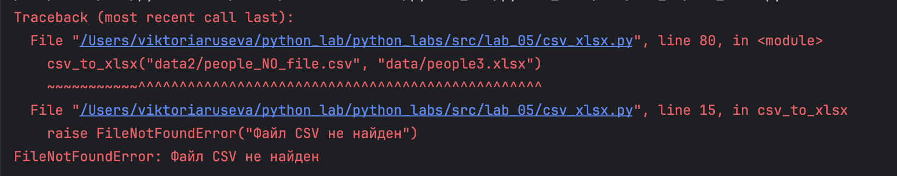

#### Проверка и валидация 
#### 1) Пустой JSON
[Картинка 1] 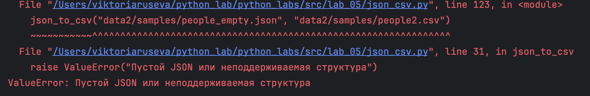
#### 2) Список с не-словарами
[Картинка 2] 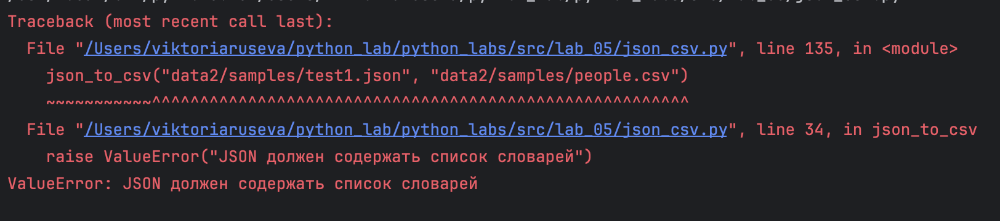
#### 3) CSV без заголовка или пустой
[Картинка 3] 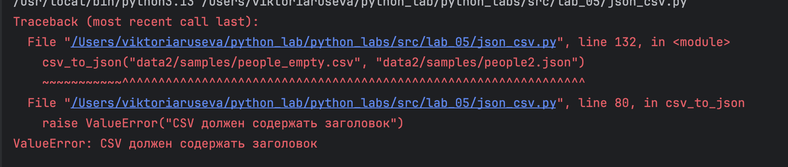
#### 4) CSV отсутствует
[Картинка 4] 
#### 5) Проверка: количество записей совпадает до и после конвертации.
```python
reread = json.loads(p_json.read_text(encoding="utf-8"))
    if len(reread) != len(data):
        raise ValueError("Количество записей не совпадает после конвертации")
```
### Пример работы json_csv.py
```python
data_dir = Path("data2/samples")
out_dir = Path("data2/out")
data_dir.mkdir(parents=True, exist_ok=True)
out_dir.mkdir(parents=True, exist_ok=True)

json_file = data_dir / "people.json"
csv_file = data_dir / "people.csv"
csv_from_json = out_dir / "people_from_json.csv"
json_from_csv = out_dir / "people_from_csv.json"

# Примерные данные
people_json = [
    {"name": "Alice", "age": "22", "city": "SPB"},
    {"name": "Bob", "age": "25", "city": "Moscow"}
]

people_csv = [
    ["name", "age",'city'],
    ["Alice", "22",'SPB'],
    ["Bob", "25",'Moscow']
]

# Запись исходных файлов
with json_file.open("w", encoding="utf-8") as f:
    json.dump(people_json, f, ensure_ascii=False, indent=2)

with csv_file.open("w", newline="", encoding="utf-8") as f:
    writer = csv.writer(f)
    writer.writerows(people_csv)

# Конвертация JSON → CSV
json_to_csv(json_file, csv_from_json)
# Конвертация CSV → JSON
csv_to_json(csv_file, json_from_csv)
```
[Картинка 1] 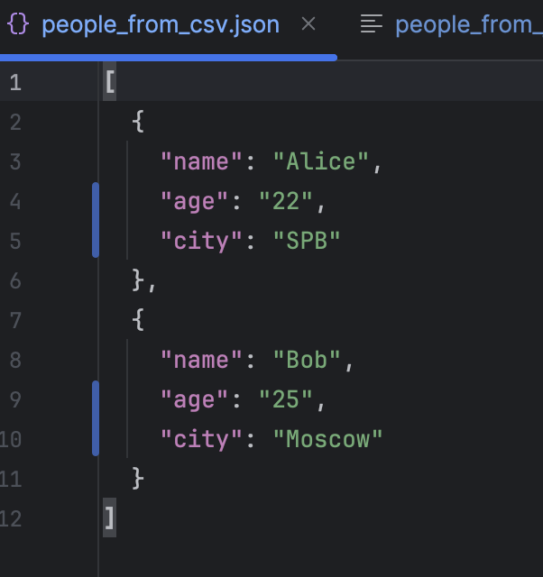

[Картинка 2] 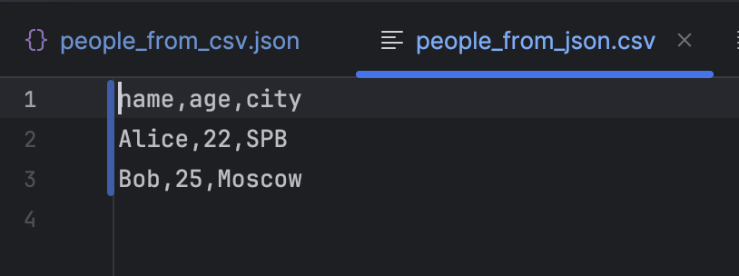
### Пример работы csv_xlsx.py
```python
#ПРИМЕР
    # Конвертация people.csv → people.xlsx
csv_to_xlsx("data2/samples/people.csv", "data2/out/people.xlsx")

csv_input = Path("data2/samples/cities.csv")
xlsx_output = Path("data2/out/cities.xlsx")

# Создаём папку out, если её нет
xlsx_output.parent.mkdir(parents=True, exist_ok=True)
csv_input.parent.mkdir(parents=True, exist_ok=True)

# Записываем пример в CSV 
example_rows = [
    ["city", "country", "language"],
    ["Moscow", "Russia", "Russian"],
    ["Tokyo", "Japan", "Japanese"],
    ["Paris", "France", "French"],
]
with csv_input.open("w", newline="", encoding="utf-8") as f:
    writer = csv.writer(f)
    writer.writerows(example_rows)

# Конвертация CSV → XLSX
csv_to_xlsx(csv_input, xlsx_output)
```
[Картинка 1] 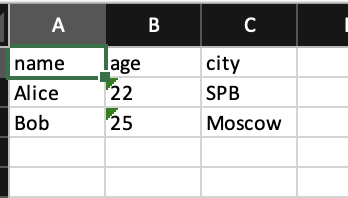

[Картинка 2] 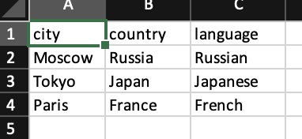