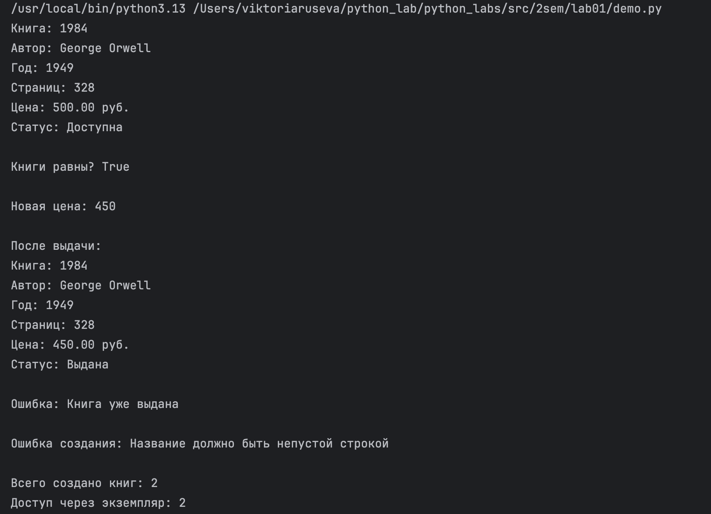

# RusevaVI
## Лабораторная работа 1

### model.py

```python
class Book:
    total_books = 0

    def __init__(self, title: str, author: str, year: int, pages: int, price: float):
        # Валидация через отдельные методы
        self._validate_title(title)
        self._validate_author(author)
        self._validate_year(year)
        self._validate_pages(pages)
        self._validate_price(price)

        self._title = title
        self._author = author
        self._year = year
        self._pages = pages
        self._price = price
        self._is_available = True

        Book.total_books += 1


    # ВАЛИДАЦИЯ

    def _validate_title(self, value):
        if not isinstance(value, str) or not value.strip():
            raise ValueError("Название должно быть непустой строкой")

    def _validate_author(self, value):
        if not isinstance(value, str) or not value.strip():
            raise ValueError("Автор должен быть непустой строкой")

    def _validate_year(self, value):
        if not isinstance(value, int) or value < 0 or value > 2026:
            raise ValueError("Год издания должен быть корректным числом")

    def _validate_pages(self, value):
        if not isinstance(value, int) or value <= 0:
            raise ValueError("Количество страниц должно быть > 0")

    def _validate_price(self, value):
        if not isinstance(value, (int, float)) or value < 0:
            raise ValueError("Цена не может быть отрицательной")

    # СВОЙСТВА

    @property
    def title(self):
        return self._title

    @property
    def author(self):
        return self._author

    @property
    def year(self):
        return self._year

    @property
    def pages(self):
        return self._pages

    @property
    def price(self):
        return self._price

    @price.setter
    def price(self, value):
        self._validate_price(value)
        self._price = value

    @property
    def is_available(self):
        return self._is_available


    # ЛОГИЧЕСКОЕ СОСТОЯНИЕ
    def borrow(self):
        if not self._is_available:
            raise ValueError("Книга уже выдана")
        self._is_available = False

    def return_book(self):
        self._is_available = True


    # БИЗНЕС-МЕТОДЫ

    def discount(self, percent: float):
        if percent < 0 or percent > 100:
            raise ValueError("Скидка должна быть от 0 до 100")
        self._price *= (1 - percent / 100)

    def is_classic(self):
        return self._year < 1970

    # МАГИЧЕСКИЕ МЕТОДЫ

    def __str__(self):
        status = "Доступна" if self._is_available else "Выдана"
        return (f"Книга: {self._title}\n"
                f"Автор: {self._author}\n"
                f"Год: {self._year}\n"
                f"Страниц: {self._pages}\n"
                f"Цена: {self._price:.2f} руб.\n"
                f"Статус: {status}")

    def __repr__(self):
        return (f"Book(title='{self._title}', author='{self._author}', "
                f"year={self._year}, pages={self._pages}, price={self._price})")

    def __eq__(self, other):
        if not isinstance(other, Book):
            return False
        return (self._title == other._title and
                self._author == other._author and
                self._year == other._year)
```

### demo.py

```python
from model import Book

# Сценарий 1 — создание объекта
book1 = Book("1984", "George Orwell", 1949, 328, 500)
print(book1)

# Сценарий 2 — сравнение объектов
book2 = Book("1984", "George Orwell", 1949, 328, 600)
print("\nКниги равны?", book1 == book2)

# Сценарий 3 — изменение через setter
book1.price = 450
print("\nНовая цена:", book1.price)

# Проверка ограничения состояния
book1.borrow()
print("\nПосле выдачи:")
print(book1)

try:
    book1.borrow()
except ValueError as e:
    print("\nОшибка:", e)

# Демонстрация валидации
try:
    bad_book = Book("", "Автор", -10, 0, -100)
except ValueError as e:
    print("\nОшибка создания:", e)

# Атрибут класса
print("\nВсего создано книг:", Book.total_books)
print("Доступ через экземпляр:", book1.total_books)
```

[Картинка1].