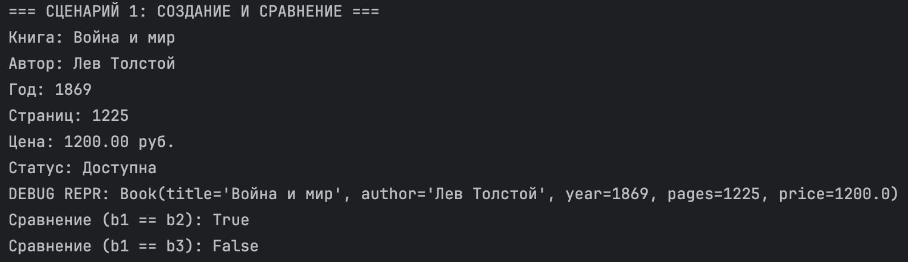
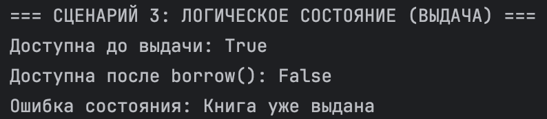
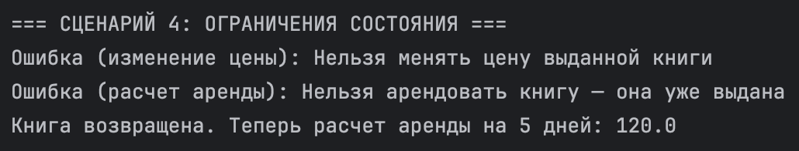
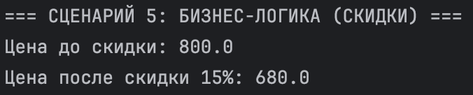
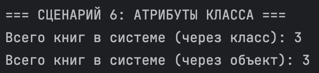

# Лабораторная работа №1

## Класс и инкапсуляция (Python)

-----

## Выбранная предметная область

Библиотека  
Реализованный класс: `Book`

-----

## Краткое описание процесса

Класс был выбран из предметной области библиотеки как базовая сущность — книга (`Book`). При разработке я ориентировалась на ключевые характеристики издания: название, автор, год, количество страниц и стоимость. В классе реализована строгая инкапсуляция через защищенные поля и свойства (`property`), а также внешняя валидация данных для предотвращения некорректных состояний объекта.

Особое внимание уделено логическому состоянию книги (`is_available`). Я добавила бизнес-методы, которые ведут себя по-разному в зависимости от того, находится книга в библиотеке или выдана читателю. Также реализованы магические методы для удобного отображения информации и сравнения книг между собой.

-----

## Краткое описание класса

`Book` — это класс, представляющий книгу в библиотечной системе.  
Содержит поля:

  - `title` — название книги  
  - `author` — автор  
  - `year` — год издания  
  - `pages` — количество страниц  
  - `price` — стоимость
  - `is_available` — статус доступности (доступна/выдана)
  - `total_books` (атрибут класса) — общее количество созданных книг

## Методы класса

  - `borrow()` — переводит книгу в статус "Выдана"  
  - `return_book()` — возвращает книгу в статус "Доступна"  
  - `discount(percent)` — применяет скидку к цене книги  
  - `calculate_rental_price(days)` — рассчитывает стоимость аренды за период  

Магические методы:

  - `__str__` — красивое описание книги для пользователя  
  - `__repr__` — техническое представление объекта для отладки  
  - `__eq__` — сравнение книг по содержанию (название, автор, год)  

-----

## Демонстрация работы (`demo.py`)

### Сценарий 1 — Базовая работа с объектом

  - Создание экземпляров книги
  - Вывод через `print`
  - Сравнение объектов (одинаковые данные vs разные книги)

**Что демонстрируется:**

  - `__str__`
  - `__repr__`
  - `__eq__`

## 

---

### Сценарий 2 — Валидация данных

  - Попытка создания книги с некорректными данными (пустое название, неверный год, отрицательная цена)
  - Ошибки при попытке установить некорректную цену через setter

**Что демонстрируется:**

  - проверки типов и диапазонов
  - работа блока `try/except`

## 

---

### Сценарий 3 — Состояние и выдача

  - Процесс выдачи книги (`borrow`) и возврата (`return_book`)
  - Ошибка при попытке выдать уже выданную книгу

**Что демонстрируется:**

  - изменение внутреннего поля `_is_available`
  - контроль логики состояний

## 

---

### Сценарий 4 — Зависимость поведения от состояния

  - Запрет на изменение цены, если книга находится у читателя
  - Запрет на расчет стоимости аренды для уже выданной книги

**Что демонстрируется:**

  - взаимодействие методов с состоянием объекта

## 

---

### Сценарий 5 — Бизнес-логика и атрибуты класса

  - Расчет стоимости аренды (2% от цены в день)
  - Применение скидки на книгу
  - Подсчет общего количества книг в системе через `total_books`

**Что демонстрируется:**

  - работа с числовыми данными
  - использование атрибутов класса (статических данных)

## 

---

### Ответы на контрольные вопросы

#### **Вопрос 1. Что является сущностью?**
Сущностью в данной работе является **Книга (Book)**. Это материальный объект библиотечного фонда, обладающий определенным набором характеристик. Это именно объект, а не действие или процесс.

#### **Вопрос 2. Какие у него атрибуты?**
Атрибуты объекта (экземпляра класса):
* `title` — название книги;
* `author` — автор;
* `year` — год издания;
* `pages` — количество страниц;
* `price` — базовая стоимость;
* `is_available` — текущая доступность (логическое состояние).

Атрибут класса (статический):
* `total_books` — счетчик, отслеживающий общее количество созданных объектов класса `Book`.

#### **Вопрос 3. Какие инварианты?**
Инварианты — это условия, которые всегда должны оставаться истинными для корректной работы программы. В моем классе это:
* **Валидность данных:** Название и автор не могут быть пустыми строками.
* **Хронология:** Год издания не может быть отрицательным или больше текущего года.
* **Физические ограничения:** Количество страниц должно быть строго больше нуля, а цена — не может быть отрицательной.
* **Согласованность состояния:** Цена книги не может быть изменена, пока объект находится в состоянии «Выдана» (`is_available = False`).

#### **Вопрос 4. Что значит «равенство»?**
В данной реализации две книги считаются **равными**, если у них совпадают ключевые идентифицирующие признаки: **название**, **автор** и **год издания**.
Второстепенные признаки (цена, количество страниц) на равенство не влияют. Данная логика реализована через переопределение магического метода `__eq__`.

#### **Вопрос 5. Есть ли состояние?**
Да, у объекта есть **логическое состояние**, которое хранится в защищенном поле `_is_available`. 
От этого состояния напрямую зависит поведение методов класса (бизнес-логика):
1.  **Метод `borrow`:** Выдает ошибку, если книга уже находится у читателя.
2.  **Сеттер `price`:** Запрещает корректировку стоимости для выданной книги.
3.  **Метод `calculate_rental_price`:** Не позволяет рассчитать стоимость аренды, если книга недоступна.

---