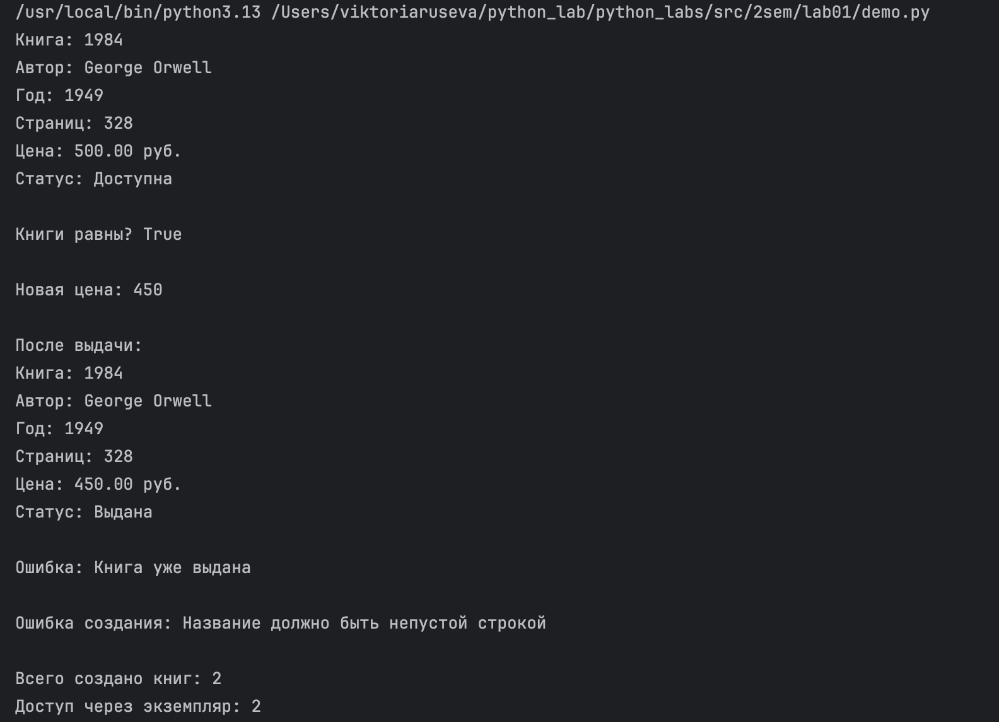
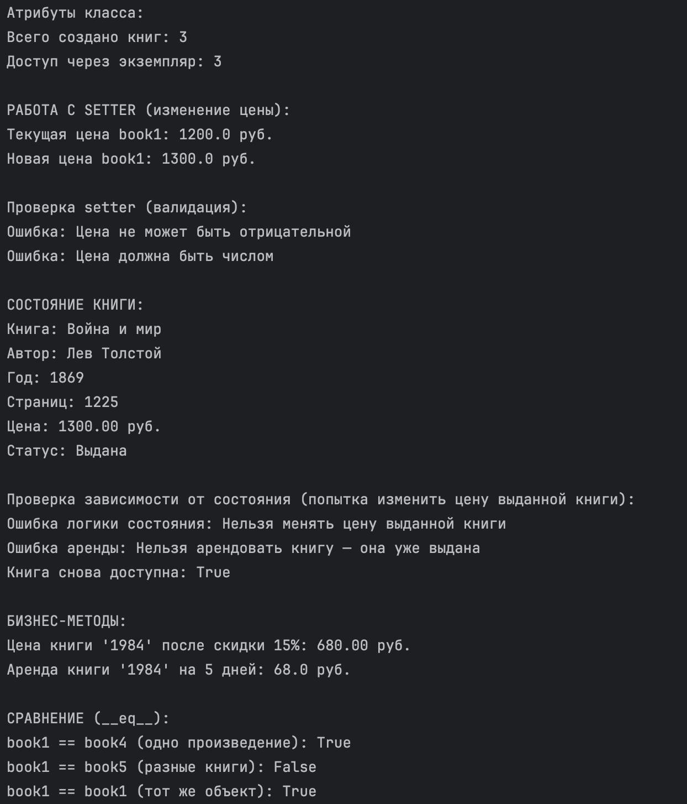
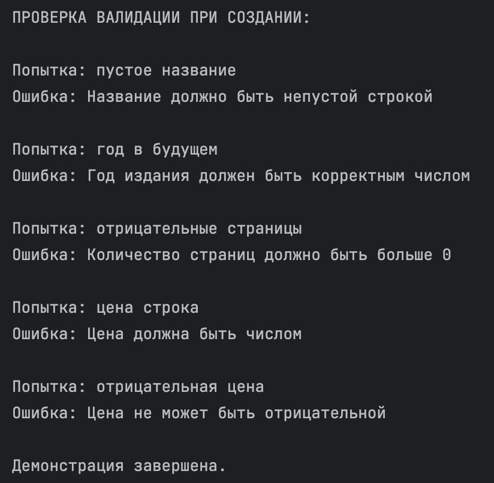

# RusevaVI
## Лабораторная работа 1

### Мыслительный процесс

Для реализации я выбрала центральную сущность — Book. 
При проектировании класса я выделила следующие ключевые атрибуты, каждый из которых решает свою задачу:

Идентификационные (title, author, year): Базовые характеристики, 
которые формируют основу книги. Именно по ним я реализовала проверку равенства объектов (магический метод __eq__), 
так как две книги с одинаковым названием, автором и годом издания логически являются одним и тем же произведением.

Физические (pages): Неизменная характеристика конкретного издания.

Коммерческие (price): Атрибут стоимости был введен специально для реализации бизнес-логики 
библиотеки — применения уценки (скидок) и расчета стоимости аренды за определенное количество дней.

Логическое состояние (is_available): Самый важный атрибут, 
отвечающий за физическую доступность книги (стоит на полке или выдана читателю). 
Я добавила его, чтобы реализовать поведение, зависящее от состояния: например, 
система жестко блокирует попытки изменить цену у книги, которая в данный момент находится на руках у читателя, или сдать её повторно.

Обработка ошибок и защита данных (валидация): Чтобы исключить работу с некорректными данными, 
я вынесла все проверки в отдельный модуль. Класс строго контролирует входные значения и генерирует исключения (ValueError, TypeError) 
при попытке задать отрицательную цену, пустую строку или неверный тип данных.

Такой набор свойств позволил сделать класс не просто структурой для хранения данных, 
а объектом с осмысленной внутренней логикой и защитой от некорректных действий.

### Ответы на вопросы

Вопрос 1. Что является сущностью?

: Это книга (Book). Это не действие, не процесс, а именно объект библиотеки.

Вопрос 2. Какие у него атрибуты?

: В моем классе:
	•	title — название
	•	author — автор
	•	year — год издания
	•	pages — количество страниц
	•	price — стоимость
	•	is_available — доступность (логическое состояние)

Также есть атрибут класса:
	•	total_books — общее количество созданных книг

Вопрос 3. Какие инварианты?
:Для моем книги:
	•	Название не пустое
	•	Автор не пустой
	•	Год ≥ 0 и ≤ текущего года
	•	Количество страниц > 0
	•	Цена ≥ 0
	•	Нельзя изменить цену, если книга выдана

Вопрос 4. Что значит “равенство”?
: Две книги равны, если совпадают:
	•	название
	•	автор
	•	год издания

Цена и количество страниц могут отличаться.

Это реализовано в __eq__.

Вопрос 5. Есть ли состояние?
Да, есть логическое состояние:
Оно хранится в _is_available.
И поведение зависит от состояния:
	•	Нельзя выдать книгу, если она уже выдана
	•	Нельзя менять цену, если книга выдана

### Скрины работы demo

