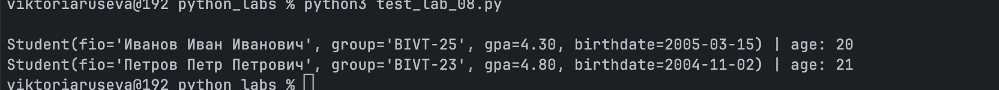
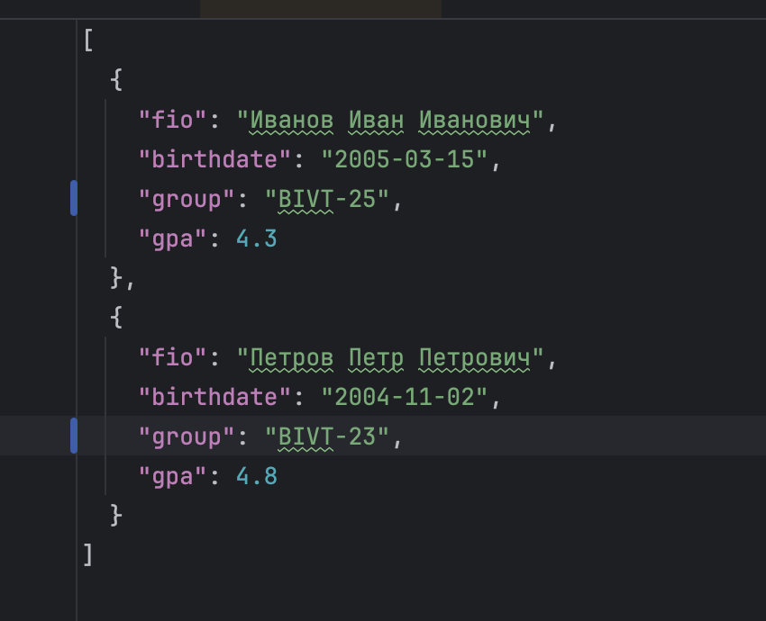
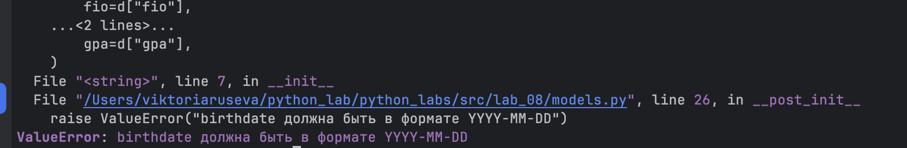
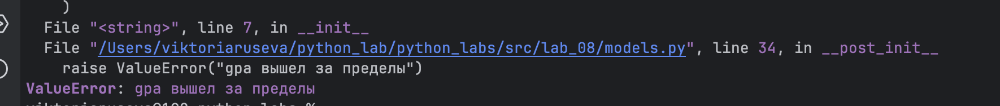
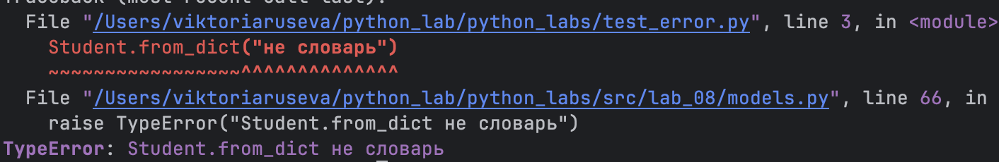
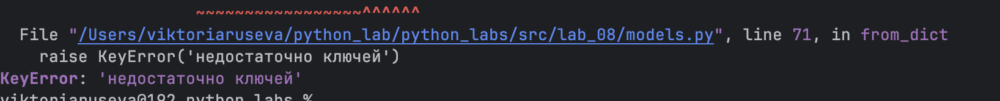
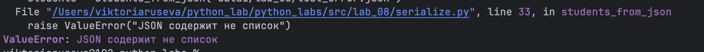

## Лабораторная работа 8
### Задание 1
```python
from dataclasses import dataclass
from datetime import date, datetime


@dataclass
class Student:
    fio: str
    birthdate: str
    group: str
    gpa: float

    def __post_init__(self) -> None:

        try:
            datetime.strptime(self.birthdate, "%Y-%m-%d")
        except ValueError :
            raise ValueError("birthdate должна быть в формате YYYY-MM-DD")

        try:
            self.gpa = float(self.gpa)
        except ValueError :
            raise ValueError("gpa должен быть число")

        if not (0.0 <= self.gpa <= 5.0):
            raise ValueError("gpa вышел за пределы")


    def age(self) -> int: 
        b = datetime.strptime(self.birthdate, "%Y-%m-%d").date()
        today = date.today()

        years = today.year - b.year
        if (today.month, today.day) < (b.month, b.day):
            years -= 1
        return years

    def to_dict(self) -> dict:
        return {
            "fio": self.fio,
            "birthdate": self.birthdate,
            "group": self.group,
            "gpa": self.gpa,
        }

    @classmethod
    def from_dict(cls, d: dict) -> "Student": 
        if not isinstance(d, dict):
            raise TypeError("Student.from_dict не словарь")

        required = ("fio", "birthdate", "group", "gpa") 
        missing = [k for k in required if k not in d]
        if missing:
            raise KeyError('недостаточно ключей')

        return cls(
            fio=d["fio"],
            birthdate=d["birthdate"],
            group=d["group"],
            gpa=d["gpa"],
        )

    def __str__(self) -> str:
        return (
            f"Student(fio='{self.fio}', group='{self.group}', "
            f"gpa={self.gpa:.2f}, birthdate={self.birthdate})"
        )
```

### Задание 2
```python
import json

try:
    from .models import Student
except ImportError:
    from models import Student  


def students_to_json(students: list[Student], path: str) -> None:

    data = [s.to_dict() for s in students]
    with open(path, "w", encoding="utf-8") as f:
        json.dump(data, f, ensure_ascii=False, indent=2)


def students_from_json(path: str) -> list[Student]:
    with open(path, "r", encoding="utf-8") as f:
        raw = json.load(f) 

    if not isinstance(raw, list):
        raise ValueError("JSON содержит не список")

    students: list[Student] = []
    for item in raw:
        students.append(Student.from_dict(item))
    return students
```
### Вывод




### Ошибки
1) Неверный формат даты

[Картинка 1] 

2) gpa нельзя привести к числу

[Картинка 2]! [8.2.png](../../images/8.2.png)

3) gpa вне диапазона

[Картинка 3] 

4) d — не словарь 

[Картинка 4] 

5) Не хватает ключей

[Картинка 5] 

6) JSON содержит не список

[Картинка 6] 