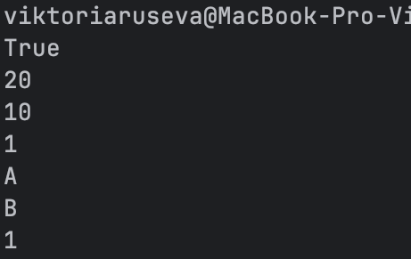
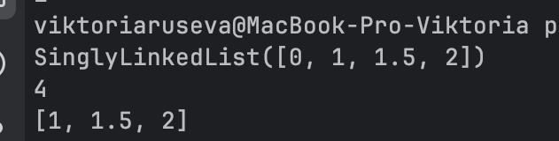
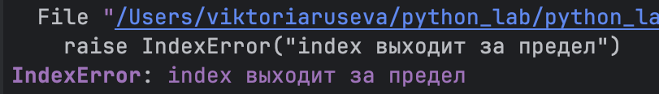
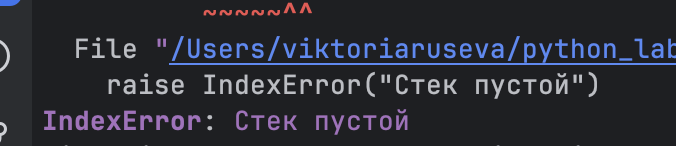
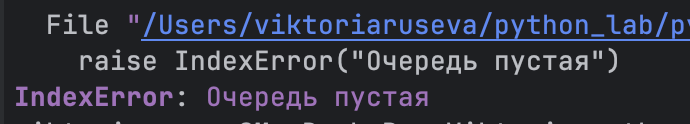

## Лабораторная работа 10
### Задание 1
```python
from collections import deque 
from typing import Any, Deque, Optional


class Stack:
    def __init__(self) -> None:
        self._data: list[Any] = []

    def push(self, item: Any) -> None:
        self._data.append(item)

    def pop(self) -> Any:
        if not self._data:
            raise IndexError("Стек пустой")
        return self._data.pop()

    def peek(self) -> Optional[Any]:
        if not self._data:
            return None
        return self._data[-1]

    def is_empty(self) -> bool:
        return not self._data

    def __len__(self) -> int:
        return len(self._data)


class Queue:
    def __init__(self) -> None:
        self._data: Deque[Any] = deque()

    def enqueue(self, item: Any) -> None:
        self._data.append(item)

    def dequeue(self) -> Any:
        if not self._data:
            raise IndexError("Очередь пустая")
        return self._data.popleft()

    def peek(self) -> Optional[Any]:
        if not self._data:
            return None
        return self._data[0]

    def is_empty(self) -> bool:
        return not self._data

    def __len__(self) -> int:
        return len(self._data)

if __name__ == "__main__":
    s = Stack()
    print(s.is_empty())
    s.push(10)
    s.push(20)
    print(s.pop())     
    print(s.peek())    
    print(len(s))     

    q = Queue()
    q.enqueue("A")
    q.enqueue("B")
    print(q.dequeue()) 
    print(q.peek())    
    print(len(q))
```
### Вывод кода



### Задание 2
```python
class Node:
    def __init__(self, value, next=None):
        self.value = value
        self.next = next


class SinglyLinkedList:
    def __init__(self):
        self.head = None 
        self._size = 0 

    def append(self, value):
        """Добавить элемент в конец списка"""
        new_node = Node(value)

        if self.head is None:
            self.head = new_node
            self._size += 1
            return

        current = self.head
        while current.next is not None:
            current = current.next

        current.next = new_node
        self._size += 1

    def prepend(self, value):
        """Добавить элемент в начало списка"""
        new_node = Node(value, next=self.head)
        self.head = new_node
        self._size += 1

    def insert(self, idx, value):
        """Вставка по индексу"""
        if idx < 0 or idx > self._size:
            raise IndexError("index выходит за предел")

        if idx == 0:
            self.prepend(value) 
            return

        current = self.head
        for _ in range(idx - 1):
            current = current.next
            if current is None:
                raise IndexError("index за пределом")

        new_node = Node(value, next=current.next)
        current.next = new_node
        self._size += 1

    def remove_at(self, idx):
        """Удалить элемент по индексу"""
        if idx < 0 or idx >= self._size:
            raise IndexError("index выходит за предел")


        if idx == 0:
            self.head = self.head.next
            self._size -= 1
            return

        current = self.head
        for _ in range(idx - 1):
            current = current.next

        current.next = current.next.next
        self._size -= 1

    def __iter__(self):
        current = self.head
        while current is not None:
            yield current.value 
            current = current.next

    def __len__(self):
        return self._size

    def __repr__(self):
        return f"SinglyLinkedList({list(self)})"
if __name__ == "__main__":
    lst = SinglyLinkedList()
    lst.append(1)
    lst.append(2)
    lst.prepend(0)
    lst.insert(2, 1.5)

    print(lst)     
    print(len(lst))  

    lst.remove_at(0)
    print(list(lst)) 
```
### Вывод кода



### Ошибки




