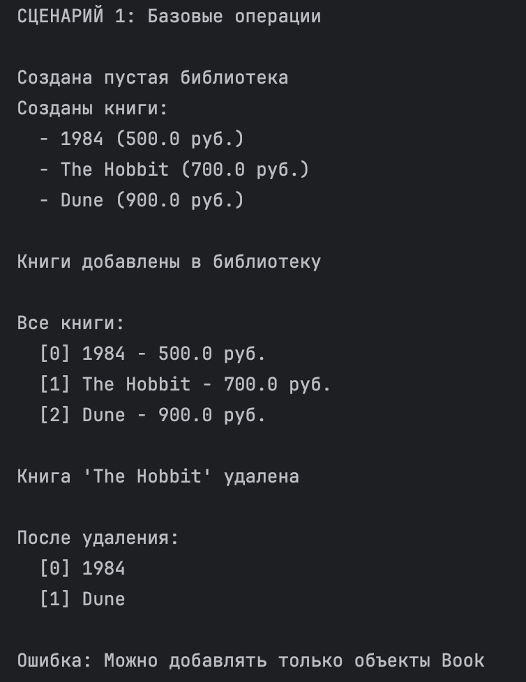
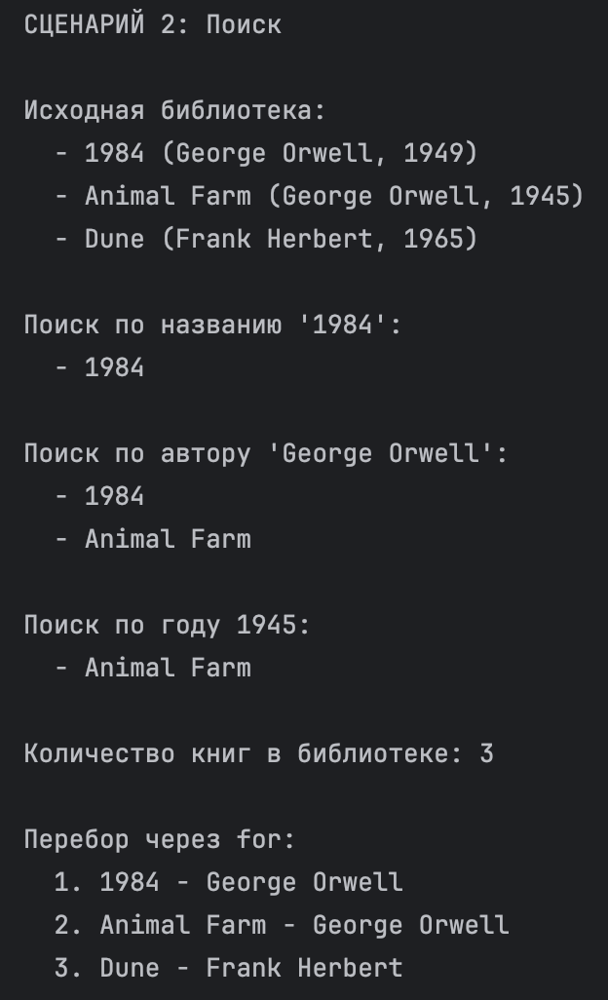
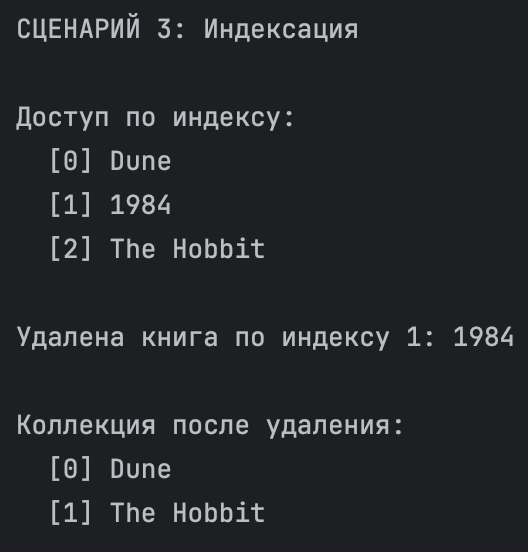
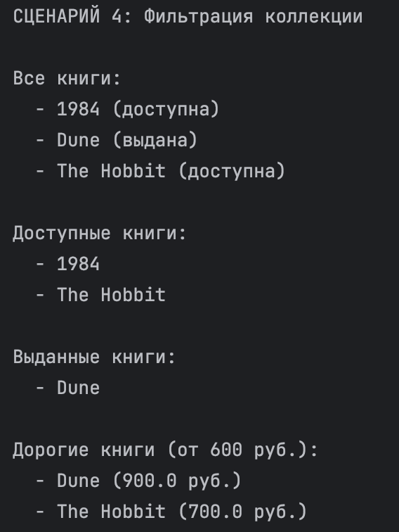
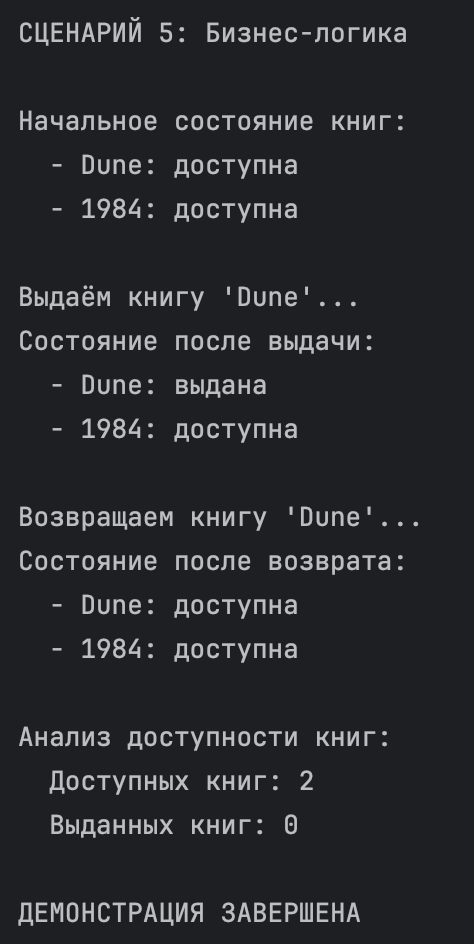

Лабораторная работа №2

Коллекция объектов (Python)

⸻

Выбранная предметная область

Библиотека / Книги

⸻

Реализованный класс коллекции: Library

Коллекция для хранения и управления объектами Book из ЛР-1.
Реализует контейнер для группы книг с возможностью добавления, удаления, поиска и фильтрации.

⸻

Краткое описание класса

Library — это контейнерный класс для управления коллекцией книг.
Внутри хранит список объектов Book.

⸻

Основные возможности:
	•	Хранение — список объектов Book
	•	Управление — добавление, удаление, доступ по индексу
	•	Поиск — по названию, автору, году
	•	Фильтрация — получение подколлекций (доступные, выданные, дорогие)
	•	Итерация — поддержка цикла for
	•	Защита — проверка типа, запрет дубликатов

⸻

Методы коллекции

Базовые операции:
	•	add(item) — добавить книгу
	•	remove(item) — удалить книгу
	•	remove_at(index) — удалить по индексу
	•	get_all() — получить список всех книг

⸻

Поиск:
	•	find_by_title(title) — поиск по названию
	•	find_by_author(author) — поиск по автору
	•	find_by_year(year) — поиск по году

⸻

Магические методы:
	•	__len__ — получение количества книг
	•	__iter__ — итерация по коллекции
	•	__getitem__ — доступ по индексу

⸻

Фильтрация (возвращают новую коллекцию):
	•	get_available() — доступные книги
	•	get_unavailable() — выданные книги
	•	get_expensive(min_price) — книги дороже заданной цены

⸻

Демонстрация работы (demo.py)

⸻

Сценарий 1 — Базовые операции

Что демонстрируется:
	•	создание объектов Book
	•	создание коллекции Library
	•	добавление книг
	•	вывод всех книг
	•	удаление книги
	•	проверка типа при добавлении

⸻

Сценарий 2 — Поиск

Что демонстрируется:
	•	поиск по названию
	•	поиск по автору
	•	поиск по году
	•	использование len()
	•	перебор через for

⸻

Сценарий 3 — Индексация

Что демонстрируется:
	•	доступ по индексу (library[0])
	•	удаление по индексу

⸻

Сценарий 4 — Фильтрация коллекции

Что демонстрируется:
	•	получение доступных книг
	•	получение выданных книг
	•	получение дорогих книг
	•	работа с новой коллекцией

⸻

Сценарий 5 — Бизнес-логика

Что демонстрируется:
	•	выдача книги (borrow)
	•	возврат книги (return_book)
	•	изменение состояния книги
	•	анализ доступности книг

⸻
