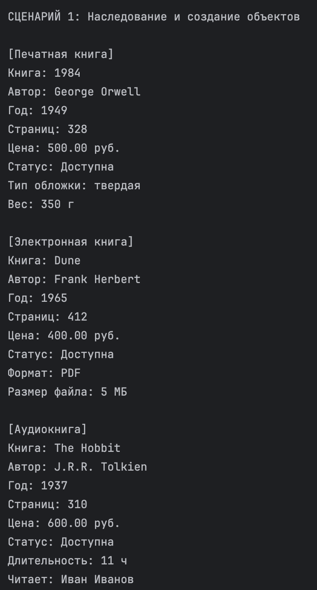
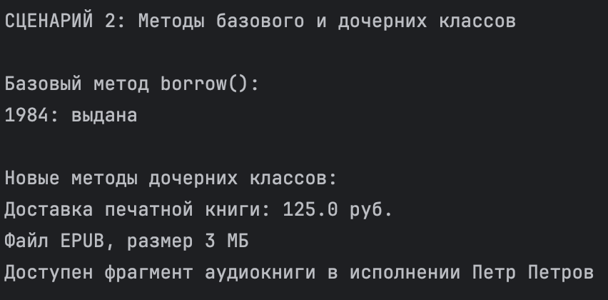
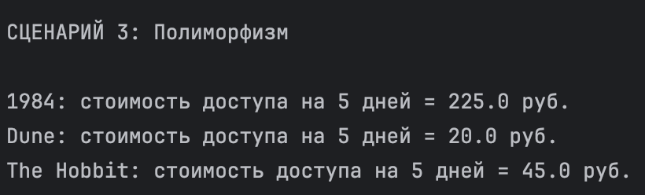
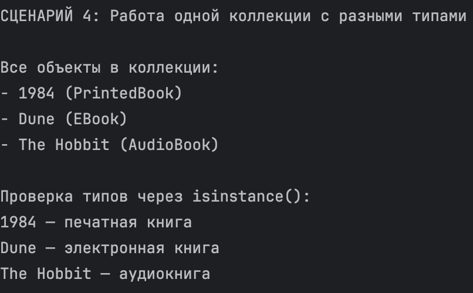
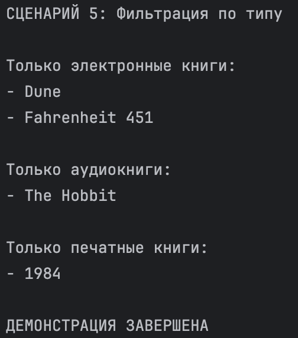

# Лабораторная работа №3
## Наследование и иерархия классов

### Цель работы

Изучить механизм наследования классов, научиться строить иерархию объектов, переиспользовать код базового класса, переопределять методы и реализовывать полиморфное поведение.

### Реализованная иерархия классов

В работе использована предметная область **Библиотека / Книги**.

Базовый класс:
- `Book` — описывает общие свойства книги:
  - название
  - автор
  - год
  - количество страниц
  - цена
  - доступность

Дочерние классы:
- `PrintedBook` — печатная книга
  - новые атрибуты: `cover_type`, `weight`
  - новый метод: `shipping_cost()`

- `EBook` — электронная книга
  - новые атрибуты: `file_format`, `file_size`
  - новый метод: `download_info()`

- `AudioBook` — аудиокнига
  - новые атрибуты: `duration`, `narrator`
  - новый метод: `listen_sample()`

### Полиморфизм

Во всех дочерних классах переопределён метод:
- `calculate_access_cost(days)`

Этот метод работает по-разному:
- у печатной книги учитывается доставка
- у электронной книги стоимость ниже
- у аудиокниги своя формула расчёта

Также переопределён метод:
- `__str__()`

### Интеграция с коллекцией

Коллекция `Library` из ЛР-2 используется для хранения объектов разных типов:
- `PrintedBook`
- `EBook`
- `AudioBook`

Так как все они наследуются от `Book`, коллекция работает с ними корректно.

Дополнительно реализована фильтрация по типу:
- `get_only_printed()`
- `get_only_ebooks()`
- `get_only_audiobooks()`

### Демонстрация работы

#### Сценарий 1 — Создание объектов разных типов
Показано:
- создание `PrintedBook`
- создание `EBook`
- создание `AudioBook`
- вывод объектов

#### Сценарий 2 — Методы базового и дочерних классов
Показано:
- использование методов базового класса
- использование новых методов дочерних классов

#### Сценарий 3 — Полиморфизм
Показано:
- вызов одного метода `calculate_access_cost()`
- разное поведение у разных классов

#### Сценарий 4 — Работа коллекции с разными типами
Показано:
- хранение разных объектов в одной коллекции
- проверка типов через `isinstance()`

#### Сценарий 5 — Фильтрация по типу
Показано:
- выбор только электронных книг
- выбор только аудиокниг
- выбор только печатных книг

### Вывод

В ходе лабораторной работы были изучены:
- наследование
- базовые и производные классы
- переиспользование кода через `super()`
- переопределение методов
- полиморфизм
- работа коллекции с объектами разных типов