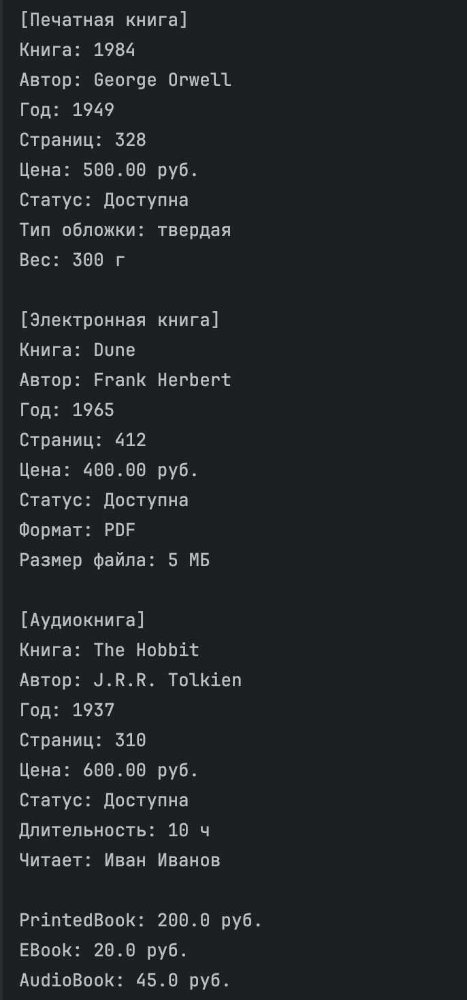
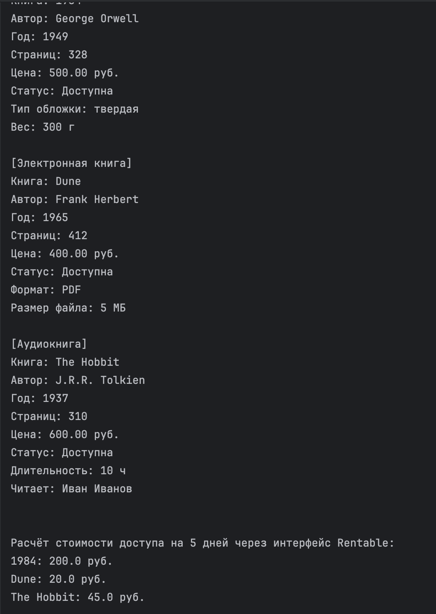
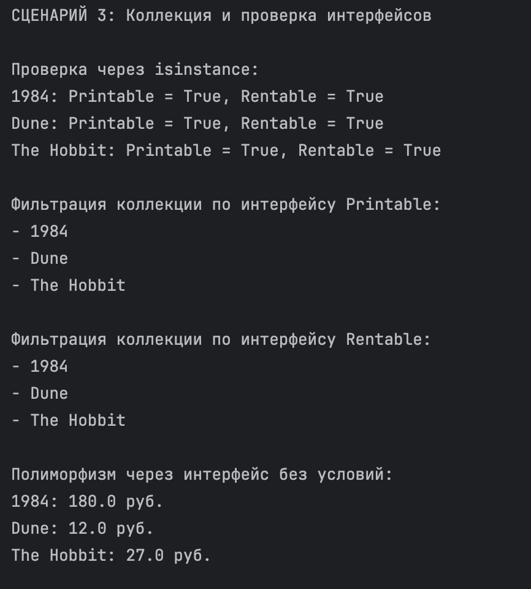

# Лабораторная работа №4
## Интерфейсы и абстрактные классы (ABC)

### Цель работы

Познакомиться с абстрактными базовыми классами (ABC), освоить понятие интерфейса, научиться задавать обязательные методы для классов и закрепить полиморфизм через единый интерфейс.

### Описание интерфейсов

В работе реализованы два интерфейса:

- `Printable`
  - требует реализацию метода `to_string()`
  - используется для строкового представления объекта

- `Rentable`
  - требует реализацию метода `calculate_access_cost(days)`
  - используется для расчёта стоимости доступа к объекту

### Реализация в классах

Интерфейсы реализованы в следующих классах:

- `Book`
- `PrintedBook`
- `EBook`
- `AudioBook`

Поведение отличается:
- `to_string()` возвращает строковое представление объекта
- `calculate_access_cost(days)` работает по-разному в разных классах:
  - `Book` — базовая стоимость аренды
  - `PrintedBook` — аренда + доставка
  - `EBook` — сниженная стоимость доступа
  - `AudioBook` — отдельная формула расчёта

### Интеграция с коллекцией

Коллекция `Library` умеет:
- хранить объекты разных типов
- работать с ними через интерфейсы
- фильтровать по интерфейсу:
  - `get_printable()`
  - `get_rentable()`

### Демонстрация

#### Сценарий 1 — Работа интерфейсных методов
Показано:
- создание объектов разных типов
- вызов `to_string()`
- вызов `calculate_access_cost(days)`

#### Сценарий 2 — Универсальные функции через интерфейс
Показано:
- работа функции `print_all(items: list[Printable])`
- работа функции `show_access_cost(items: list[Rentable], days)`

#### Сценарий 3 — Коллекция и проверка интерфейсов
Показано:
- единый список объектов разных типов
- проверка через `isinstance`
- фильтрация по интерфейсу
- полиморфизм без условий

### Вывод

В ходе работы были изучены:
- абстрактные базовые классы
- интерфейсы как контракт поведения
- обязательные методы в классах
- полиморфизм через общий интерфейс
- работа коллекции с объектами через интерфейс