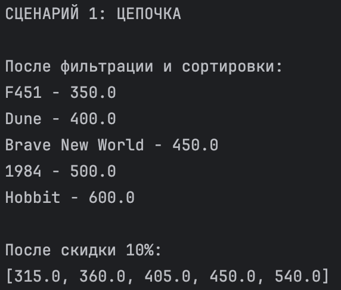
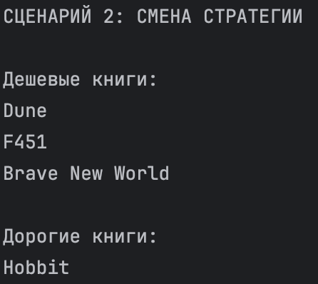
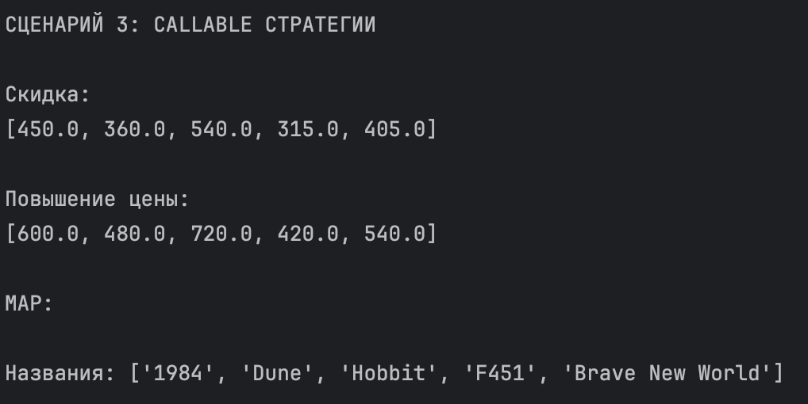

# Лабораторная работа №5
## Функции как аргументы. Стратегии

## Цель работы

Изучить:
- передачу функций как аргументов
- lambda, map, filter
- функции высшего порядка
- паттерн «Стратегия»

---

## Реализовано

### Стратегии сортировки
- by_title
- by_price
- by_year
- by_title_then_price

### Фильтры
- is_expensive
- is_available

### Фабрика функций
- make_price_filter(max_price)

### map()
- получение названий
- применение скидки

### Стратегии (callable)
- DiscountStrategy
- IncreasePriceStrategy

---

## Коллекция

Добавлены методы:
- sort_by()
- filter_by()
- apply()

---

## Демонстрация

### Сценарий 1

Цепочка:
filter → sort → apply

### Сценарий 2

Смена стратегии фильтрации

### Сценарий 3

Использование callable-объектов

---

## Вывод

Изучены:
- функции как аргументы
- lambda, map, filter
- функции высшего порядка
- паттерн стратегия