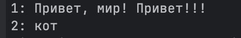
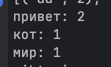

# Лабораторная работа №6
## Generics и typing

---

# Цель работы

Изучить:
- аннотации типов
- Generic и TypeVar
- Protocol
- структурную типизацию

---

# Реализованные типы и контейнеры

## TypedCollection[T]

Обобщённая коллекция с поддержкой:
- add()
- remove()
- find()
- filter()
- map()

Используется Generic и TypeVar.

---

## TypeVar

Использованы:
- T — тип элементов коллекции
- R — тип результата map()
- D — объекты Displayable
- S — объекты Scorable

---

# Protocol

## Displayable

Требует метод:

```python
display() -> str
```

---

## Scorable

Требует метод:

```python
score() -> float
```

---

# Демонстрация работы (demo.py)

## Сценарий 1: TypedCollection

- Создание строго типизированной коллекции `TypedCollection[PrintedBook]`
- Демонстрация типобезопасного добавления объектов
- Итерация с сохранением информации о типе



---

## Сценарий 2: find / filter / map

- **find**: поиск первого элемента по условию (возвращает объект или `None`)
- **filter**: получение отфильтрованного списка элементов
- **map**: демонстрация смены типа (из коллекции `EBook` получаем `list[str]` с названиями и `list[float]` с ценами)


---

## Сценарий 3: Protocol

- `DisplayCollection`: принимает объекты разных типов (PrintedBook, AudioBook), объединённые наличием метода `display()`
- `ScoreCollection`: принимает объекты разных типов (EBook, AudioBook), объединённые наличием метода `score()`
- Демонстрация "утиной типизации" без явного наследования от интерфейсов



---

# Вывод

Что было изучено:
- Аннотации типов делают код более предсказуемым и самодокументируемым.
- Generics позволяют писать универсальные классы, сохраняя строгий контроль типов.
- Protocol как структурный интерфейс помогает задавать требования к поведению объектов без жесткой привязки к иерархии наследования.
- Использование `typing` в целом помогает обнаруживать ошибки на этапе написания кода и облегчает поддержку.