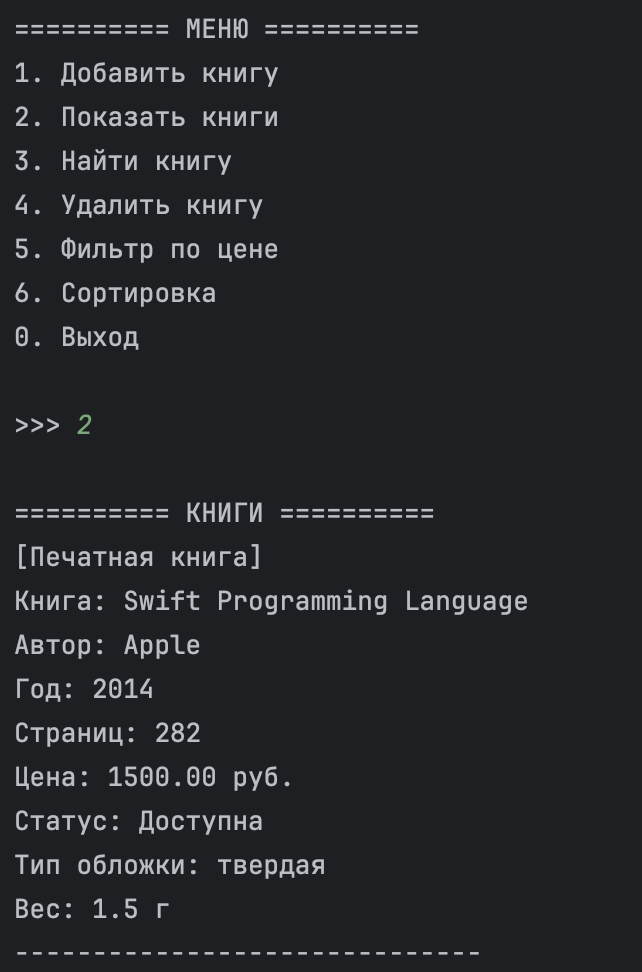
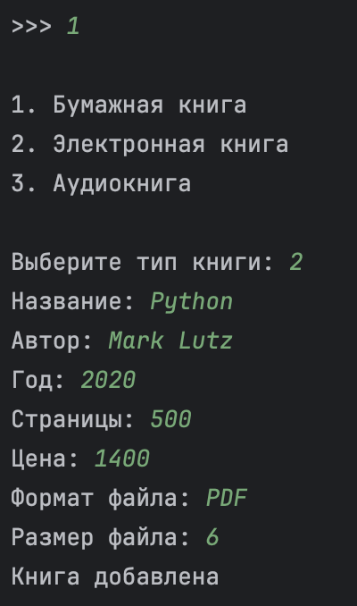
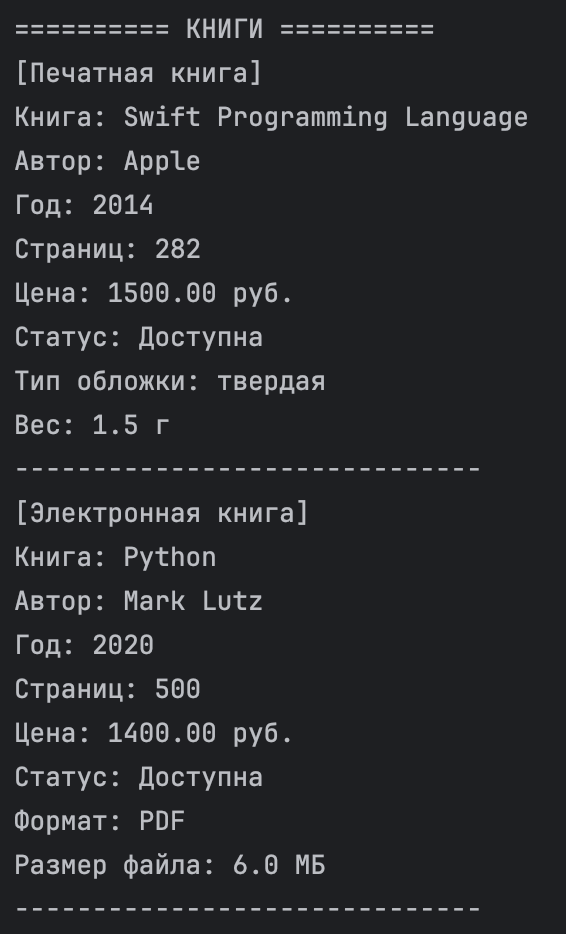
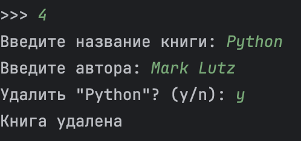
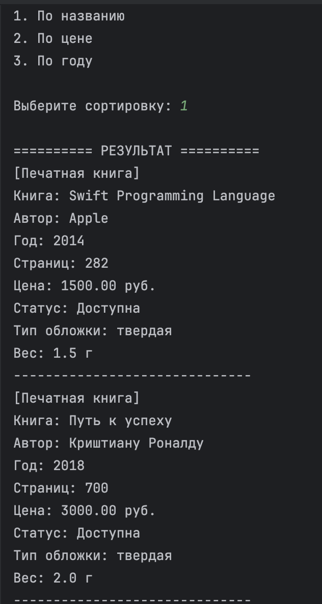
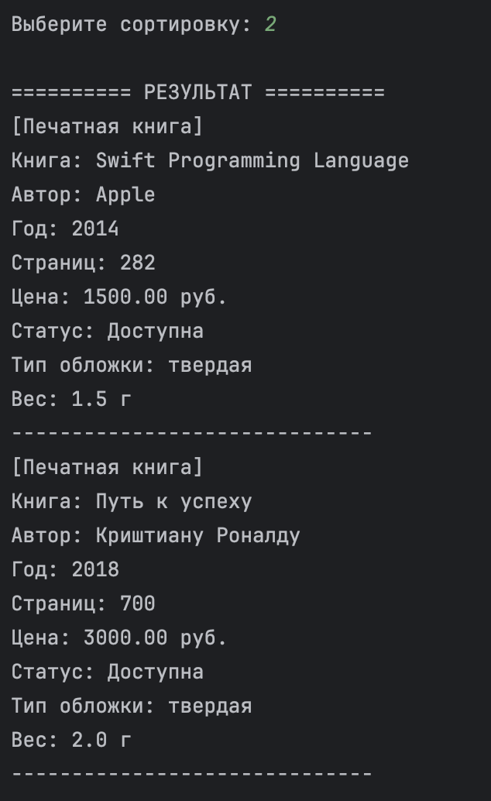
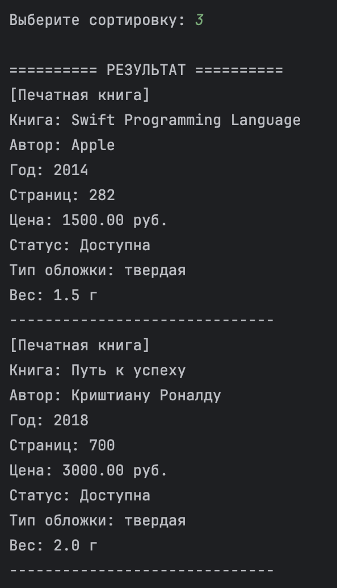
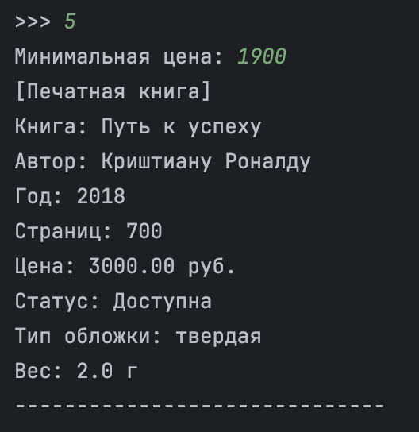
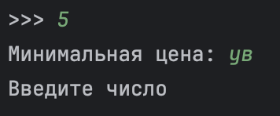

# Лабораторная работа №7. Консольное приложение

## 1. Цель работы

Объединить знания и наработки, полученные в ходе выполнения лабораторных работ ЛР1–ЛР6, в единое полноценное работающее приложение. Реализовать интерактивный консольный интерфейс (CLI) с меню, обработкой пользовательского ввода, разделением архитектуры на независимые слои, статической типизацией и автоматическим сохранением/загрузкой данных через JSON-файл.

---

## 2. Структура проекта

В соответствии с требованиями к архитектуре, проект разделен на независимые модули и слои (бизнес-логика, интерфейс, хранилище данных):

```text
python_labs/
├── README.md
├── src/
│   └── sem2/
│       ├── lab01/
│       │   └── validate.py
│       ├── lab02/
│       │   └── collection.py
│       └── lab07/
│           ├── README.md
│           ├── main.py
│           ├── cli.py
│           ├── app.py
│           ├── models.py
│           ├── exceptions.py
│           ├── storage.py
│           └── books.json
└── images/
    └── lab07/
````

### **Назначение файлов**

|**Файл**|**Назначение**|
|---|---|
|`main.py`|Точка входа в приложение|
|`cli.py`|Консольный интерфейс, меню, ввод и вывод|
|`app.py`|Бизнес-логика приложения|
|`models.py`|Классы предметной области|
|`storage.py`|Сохранение и загрузка данных|
|`exceptions.py`|Пользовательские исключения|
|`books.json`|JSON-файл хранения данных|

---

## **3. Описание CLI и архитектуры**

### **Консольное меню**

Приложение работает в цикле и предоставляет пользователю следующее меню:

```text
1. Добавить книгу
2. Показать книги
3. Найти книгу
4. Удалить книгу
5. Фильтр по цене
6. Сортировка
7. Выход
```

---

### **Описание пунктов меню**

#### **1. Добавить книгу**

Пользователь выбирает тип книги:

- бумажная книга (`PrintedBook`)
- электронная книга (`EBook`)
- аудиокнига (`AudioBook`)

После этого вводятся соответствующие атрибуты объекта.

---

#### **2. Показать книги**

Вывод всей коллекции в структурированном виде.

---

#### **3. Найти книгу**

Поиск книги по названию или части названия.

---

#### **4. Удалить книгу**

Удаление книги по названию с обязательным подтверждением операции:

```text
Удалить "Python"? (y/n):
```

---

#### **5. Фильтр по цене**

Отображение книг, цена которых больше или равна введённому значению.

---

#### **6. Сортировка**

Поддерживаются стратегии сортировки:

- по названию
- по цене
- по году издания

---

#### **7. Выход**

Завершение работы программы с автоматическим сохранением данных.

---

## **Обработка ошибок**

Приложение содержит обработку некорректного пользовательского ввода:

- ввод строки вместо числа
- пустые значения
- отрицательные значения цены и страниц
- некорректный год
- попытка добавить дубликат
- поиск несуществующей книги
- повреждённый JSON-файл

Все ошибки обрабатываются через `try-except`, благодаря чему программа не завершается аварийно.

---

## **Архитектура приложения**

Проект разделён на 3 слоя.

### 

### **`cli.py`**

**— слой представления**

Отвечает только за:

- `input()`
- `print()`
- отображение меню

CLI не работает с коллекцией напрямую.

---

### 

### **`app.py`**

**— слой бизнес-логики**

Класс `LibraryApp`:

- управляет коллекцией
- создаёт объекты
- выполняет поиск
- выполняет фильтрацию
- выполняет сортировку
- проверяет дубликаты

---

### 

### **`models.py`**

**— слой моделей**

Содержит:

- базовый класс `Book`
- наследников:
    - `PrintedBook`
    - `EBook`
    - `AudioBook`

Также реализованы:

- инкапсуляция
- наследование
- переопределение `__str__`
- валидация данных

---

## **Сохранение и загрузка данных**

### **Автозагрузка**

При запуске программы автоматически вызывается:

```python
load("books.json")
```

Файл JSON считывается и восстанавливаются объекты нужных классов.

---

### **Автосохранение**

При завершении работы программы автоматически вызывается:

```python
save(collection, "books.json")
```

Все данные сериализуются в JSON-файл.

---

## **4. Демонстрация работы**

### **Сценарий 1. Запуск приложения и автозагрузка данных**

При запуске программы данные автоматически загружаются из `books.json`. После выбора пункта `2` отображается коллекция книг.


---

### **Сценарий 2. Добавление и удаление книги с подтверждением**

Продемонстрированы:

- добавление новой книги
- отображение обновлённой коллекции
- удаление книги с подтверждением операции
- автоматическое сохранение данных




---

### **Сценарий 3. Сортировка коллекции**

Продемонстрирована работа сортировки:

- по названию
- по цене
- по году издания





---

### **Сценарий 4. Фильтрация и обработка ошибок**

Продемонстрированы:

- фильтрация книг по минимальной цене
- обработка некорректного ввода
- перехват исключений



---

## **Дополнительное задание ⭐**

Для демонстрации работы CLI была использована утилита asciinema.

Запись содержит:

- запуск приложения
- добавление и удаление книг
- сортировку
- фильтрацию
- обработку ошибок

### **Ссылка на запись**

[](https://asciinema.org/a/olBCloIrnzdPy80M)


---

## **5. Вывод**

В ходе выполнения лабораторной работы были успешно закреплены следующие навыки:

1. Разработка консольных приложений на Python.
2. Разделение проекта на независимые модули и слои.
3. Работа с объектно-ориентированным программированием:
    - наследование
    - инкапсуляция
    - полиморфизм
4. Создание и обработка пользовательских исключений.
5. Работа с JSON-файлами.
6. Реализация сортировки, поиска и фильтрации.
7. Использование аннотаций типов и docstring.
8. Организация устойчивого CLI-интерфейса с обработкой ошибок.
9. Работа с утилитой asciinema для записи терминальных сессий.